# Report for technical cooperation between Georgia Institute of Technology and ONS – Operador Nacional do Sistema El´etrico

Alexander Shapiro and Wajdi Tekaya School of Industrial and Systems Engineering, Georgia Institute of Technology, Atlanta, Georgia 30332-0205, USA

Joari Paulo da Costa and Murilo Pereira Soares ONS - Operador Nacional do Sistema El´etrico Rua da Quitanda, 196, Centro Rio de Janeiro, RJ, 20091-005, Brasil

April 05, 2011

## Contents

- 1 Introduction 1
- 2 Generic description of the SDDP algorithm 3

- 2.1 Backward step of the SDDP algorithm . . . . . . . . . . . . . . . . . . . . . . . . . . 3
- 2.2 Forward step of the SDDP algorithm . . . . . . . . . . . . . . . . . . . . . . . . . . . 5

- 3 Case-study description 6
- 4 Stopping criteria and validation of the optimality gap 7

- 4.1 Lower bound and gap based stopping criteria . . . . . . . . . . . . . . . . . . . . . . 8

- 4.1.1 Lower bound/cpu-time based stopping criterion . . . . . . . . . . . . . . . . . 9
- 4.1.2 Gap based stopping criterion . . . . . . . . . . . . . . . . . . . . . . . . . . . 10

- 4.2 Policy value stopping criterion . . . . . . . . . . . . . . . . . . . . . . . . . . . . . . 11
- 4.3 Parallel SDDP . . . . . . . . . . . . . . . . . . . . . . . . . . . . . . . . . . . . . . . 13

- 5 Number of cuts per iteration 15
- 6 Impact of the total number of stages 17
- 7 Policy evaluation for the true problem 18
- 8 Simple cut-removal strategies 18
- 9 Conclusions 23 A Appendix – SDDP algorithm 25

## 1 Introduction

The Brazilian power system generation is hydro dominated (about 75% of the installed capacity) and characterized by large reservoirs presenting multi-year regulation capability, arranged in complex cascades over several river basins. The hydro plants use stored water in the reservoirs to produce energy in the future, replacing fuel costs from the thermal units. Since the water inflows depend on rainfalls, the amount of future in inflows is uncertain and cannot be predicted with a high accuracy. Moreover, historical records indicate possibility of some very dry time periods which, of course, can put a severe burden on hydro power generation.

Mathematical algorithms compose the core of the Energy Operation Planning Support System. The objective is to compute an operation strategy which controls the operation costs, over a planning period of time, in a reasonably optimal way. This leads to formulation of (linear) large scale multistage stochastic programming problems of the form

  min

 . (1.1)

cT1x1 + E

cT2x2 + E ··· + E min

cTTxT

Min A1x1=b1 x1≥0

B2x1+A2x2=b2 x2≥0

BT xT 1+AT xT =bT xT ≥0

Components of vectors ct,bt and matrices At,Bt are modeled as random variables forming the stochastic data process ξt = (ct,At,Bt,bt), t = 2,...,T, with ξ1 = (c1,A1,b1) being deterministic (not random). By ξ[t] = (ξ1,...,ξt) we denote history of the data process up to time t.

It is often assumed in numerical approaches to solving multistage problems of the form (1.1) that the number of realizations (scenarios) of the data process is finite, and this assumption is essential in the implementations and analysis of the applied algorithms. In many applications, however, this assumption is quite unrealistic. In forecasting models (such as ARIMA) the errors are typically modeled as having continuous (say normal or log-normal) distributions. So one of the relevant questions is what is the meaning of the introduced discretizations of the corresponding stochastic process. In this research we do not make the assumption of finite number of scenarios, instead the following assumptions will be made. These assumptions (below) are satisfied in the applications relevant for the Brazilian power system generation.

We make the basic assumption that the random data process is stagewise independent, i.e., random vector ξt+1 is independent of ξ[t] = (ξ1,...,ξt) for t = 1,...,T 1. In some cases across stages dependence can be dealt with by adding state variables to the model. In particular, the following construction is relevant for the considered applications. Suppose that only the right hand side vectors bt, t = 2,...,T, are random, while other parameters of the problem (i.e., matrices At, Bt and vectors ct) are known (deterministic). Suppose, further, that random vectors bt, t = 2,...,T, form a first order autoregressive process, i.e., bt = Φbt 1 + εt, with appropriate matrix Φ and error vectors ε2,...,εT being independent of each other. Then the feasibility equations of problem (1.1) can be written as

bt Φbt 1 = εt, Btxt 1 Φbt 1 + Atxt = εt, xt ≥ 0, t = 2,...,T. (1.2)

Therefore by replacing xt with (xt,bt) and data process with εt, t = 2,...,T, we transform the problem to the stagewise independent case. The same approach can be used if bt is modeled as a PAR(p) process.

Let us emphasize again that in modeling the uncertain data as an autoregressive type process the involved errors are modeled as independently distributed random variables having continuous distributions. In order to solve the corresponding multistage problem (1.1) one needs to make a discretization of these continuous distributions. Therefore we consider the following approach

to solving the multistage problem (1.1). First, a (finite) scenario tree is generated by randomly sampling from the original distribution and then the constructed problem is solved by the Stochastic Dual Dynamic Programming (SDDP) algorithm. The main goal of this research is to investigate computational issues of solving multistage stochastic programming problems by the SDDP method.

There are three levels of approximations in the setting of the current system. The first level is modeling. The inflows are viewed as seasonal time series and modeled as a periodic auto-regressive (PAR(p)) process. Any such modeling involves inaccuracies - autoregressive parameters should be estimated, errors distributions are not precise, etc. Although modeling is a very important issue since it gives an input for the consequent computations, we do not discuss it at this stage of our investigation. We refer to an optimization problem based on a current time series model as the “true” problem. Of course, there is no “true” model giving an exact representation of the real world. As a famous saying going: “every model is wrong but some are useful”. This terminology is motivated by statistical applications where one often talks about population (i.e., true) values of considered parameters.

The “true” model involves time series errors ξt, t = 1,...,T, having continuous distributions. Since the corresponding expectations (multidimensional integrals) cannot be computed in a closed form, one needs to make a discretization of the data process ξt. So a sample ˜ξ1t,..., ˜ξNtt, of size Nt, from the distribution of the random vector ξt, t = 1,...,T, is generated. These samples (of the respective sizes N1,...,NT) generate a scenarios tree with the total number of scenarios N =

T t=1 Nt, each with equal probability 1/N. Consequently the true problem is approximated by the so-called Sample Average Approximation (SAA) problem associated with this scenarios tree. This corresponds to the second level of approximation in the current system. It is worthwhile to note that in such construction of the scenarios tree the stagewise independence of the original random process is preserved in the constructed SAA problem. This is essential for an implementation of the SDDP algorithm.

Even with a moderate number of scenarios per stage, say each Nt = 100, the total number of scenarios N quickly becomes astronomically large with increase of the number of stages. Therefore a constructed SAA problem can be solved only approximately. This leads to the third level of approximation in the current system. The SDDP method suggests a computationally tractable approach to solving SAA, and hence the “true”, problem. At the first stage of this investigation we concentrate on studying properties of the SDDP algorithm for solving SAA problems. It should be not forgotten, however, that our real goal is to solve the “true” problem and that SAA problems, considered as approximations of the true problem, have their own variabilities (inaccuracies).

This report gives a summary of the results of the first stage of this project. This document consolidates the Phase One research activities developed along the First Stage of the Technical Cooperation between Georgia Institute of Technology and ONS. These activities concentrated on studying properties of the SDDP algorithm for solving SAA problems and the following issues were investigated:

- (i) Lower bound and gap based stopping criteria.
- (ii) Number of cuts per iteration.
- (iii) Impact of the total number of stages.
- (iv) Policy evaluation for the true problem.
- (v) Simple cut-removal strategies.

## 2 Generic description of the SDDP algorithm

There are several approximations in the SDDP approach. First a random sample is generated and the true problem is approximated by the corresponding SAA problem. Then the SDDP algorithm is applied to the SAA problem. Suppose that Nt, t = 2,...,T, points are generated at every stage of the process. We assume that first stage data are known, i.e., ξ1 is deterministic and hence N1 = 1 (no sampling at the first stage). Let

ξjt = (ctj,Atj,Btj,btj), j = 1,..,Nt, t = 2,...,T, (2.1) be the generated points. As it was already mentioned the total number of scenarios of the SAA problem is N = Tt=1 Nt and can be very large. In this section we deal only with the SAA problem, i.e., we only consider scenarios corresponding to points in (2.1). Therefore, in order to simplify notation, we do not use here the “tilde” sign for the sampled points ξjt.

### 2.1 Backward step of the SDDP algorithm

Let ¯xt, t = 1,...,T 1, be trial points (we can use more than one trial point at every stage of the backward step, an extension to that will be straightforward). Let Qt(·) be the cost-to-go functions of dynamic programming equations associated with the considered multistage problem (cf., [1]), and Qt(·) be a current approximation of Qt(·) given by the maximum of a collection of cutting planes

αtk + βTtkxt 1 , t = 1,...,T 1. (2.2) At stage t = T we solve the following problems

Qt(xt 1) = max k∈It

cTTjxT s.t. BTj¯xT 1 + ATjxT = bTj, xT ≥ 0, j = 1,...,NT. (2.3)

Min xT ∈RnT

Recall that QTj(¯xT 1) is equal to the optimal value of problem (2.3) and that subgradients of QTj(·) at ¯xT 1 are given by BTTjπTj, where πTj is a solution of the dual of (2.3). Therefore for the cost-to-go function QT(xT 1) we can compute its value and a subgradient at the point ¯xT 1 by averaging the optimal values of (2.3) and the corresponding subgradients. Consequently we can construct a supporting plane to QT(·) and add it to the current collection of supporting planes of QT(·). Note that if we have several trial points at stage T 1, then this procedure should be repeated for each trial point and we add each constructed supporting plane.

Now going one stage back let us recall that QT 1,j(¯xT 2) is equal to the optimal value of problem

cTT 1,jxT 1 + QT(xT 1) s.t. BT 1,j¯xT 2 + AT 1,jxT 1 = bT 1,j, xT 1 ≥ 0. (2.4)

Min xT 1∈RnT 1

However, function QT(·) is not available. Therefore we replace it by QT(·) and hence consider problem

cTT 1,jxT 1 + QT(xT 1) s.t. BT 1,j¯xT 2 + AT 1,jxT 1 = bT 1,j, xT 1 ≥ 0. (2.5)

Min xT 1∈RnT 1

Recall that QT(·) is given by maximum of affine functions (see (2.2)). Therefore we can write problem (2.5) in the form

cTT 1,jxT 1 + θ s.t. BT 1,j¯xT 2 + AT 1,jxT 1 = bT 1,j, xT 1 ≥ 0 θ ≥ αTk + βTTkxT 1, k ∈ IT.

Min xT 1∈RnT 1,θ∈R

(2.6)

Consider the optimal value, denoted QT 1,j(¯xT 2), of problem (2.6), and let πT 1,j be the partial vector of an optimal solution of the dual of problem (2.6) corresponding to the constraint BT 1,j¯xT 2 + AT 1,jxT 1 = bT 1,j, and let

NT 1

1 NT 1

QT 1(¯xT 2) :=

QT 1,j(¯xT 2)

j=1

and

gT 1 =

NT 1

1 NT 1

BTT 1,jπT 1,j.

j=1

Consequently we add the corresponding affine function to collection of QT 1(·). And so on going backward in t. Note that the (last stage) cost-to-go function QT(·) is not available for computations. What do we have is its lower approximation QT(·), i.e., QT(·) ≥ QT(·) (this inequality could, and usually will, be strict). This is why problem (2.4) is replaced by problem (2.5) at this stage of the backward step procedure. The constructed affine function is a supporting plane of QT 1(·). Since QT 1(·) could be strictly smaller than QT 1(·), the constructed affine function could be only a cutting plane of QT 1(·).

The computed approximations Q2(·),...,QT(·) (with QT+1(·) ≡ 0 by definition) and a feasible first stage solution ¯x1 can be used for constructing an implementable policy as follows. For a realization

ξt = (ct,At,Bt,bt), t = 2,...,T,

of the data process, decisions ¯xt, t = 1,...,T, are computed recursively going forward with ¯x1 being the chosen feasible solution of the first stage problem, and ¯xt being an optimal solution of

cTtxt + Qt+1(xt) s.t. Atxt = bt Bt¯xt 1, xt ≥ 0, (2.7)

Min xt

for t = 2,...,T. These optimal solutions can be used as trial decisions in the backward step of the algorithm. Note that ¯xt is a function of ¯xt 1 and ξt, i.e., ¯xt is a function of ξ[t] = (ξ1,...,ξt), for t = 2,...,T. That is, policy ¯xt = ¯xt(ξ[t]) is nonanticipative and by the construction satisfies the feasibility constraints for every realization of the data process.

Thus the computed approximations Q2(·),...,QT(·) (i.e., the cuts stored in the computer memory) and the first stage solution define an implementable and feasible policy for both – the true and SAA problems. That is, if we restrict the data process to the generated sample, i.e., we consider only realizations ξ2,...,ξT of the data process drawn from scenarios of the SAA problem, then ¯xt = ¯xt(ξ[t ) becomes an implementable and feasible policy for the corresponding SAA problem. On the other hand, if we consider realizations ξ2,...,ξT of the true problem, then this gives an implementable and feasible policy for the true problem.

Since the policy ¯xt = ¯xt(ξ[t]) is feasible, the expectation

E

T

cTt¯xt(ξ[t]) (2.8)

t=1

gives an upper bound for the optimal value of the corresponding multistage problem. If we take this expectation over the true probability distribution of the random data process, then the above expectation (2.8) gives an upper bound for the optimal value of the true problem. On the other hand, if we restrict the data process to scenarios of the SAA problem, each with equal probability 1/N, then the expectation (2.8) gives an upper bound for the optimal value of the SAA problem conditional on the sample used in construction of the SAA problem.

### 2.2 Forward step of the SDDP algorithm

The forward step of the SDDP algorithm consists in generating M random realizations (scenarios) of the data process and computing the respective optimal values

T

cTtj¯xtj, j = 1,...,M.

ϑj :=

t=1

That is, ϑj is the value of the corresponding policy for the realization ξ1,ξj2,...,ξjT of the data process. As such ϑj is an unbiased estimate of expected value of that policy, i.e., E[ϑj] = E Tt=1 cTt¯xt(ξ[t]) .

The forward step has two functions. First, some (all) of computed solutions ¯xtj can be used as trial points in the next iteration of the backward step of the algorithm. Second, these solutions can be employed for constructing a statistical upper bound for the optimal value of the corresponding multistage program (true or SAA depending on from what distribution the sample scenarios were generated).

Consider the average (sample mean) ˜ϑM := M 1 Mj=1 ϑj and standard error

˜σM :=

M

1 M 1

(ϑj ˜ϑM)2

j=1

of the computed values ϑj. Since ϑj is an unbiased estimate of the expected value of the constructed policy, we have that ˜ϑM is also an unbiased estimate of the expected value of that policy. By invoking the Central Limit Theorem we can say that ˜ϑM has an approximately normal distribution provided that M is reasonably large. This leads to the following (approximate) (1 α)-confidence upper bound for the value of that policy

˜σM √

˜ϑM + zα

. (2.9)

M

The corresponding (1 α)-confidence lower bound is

˜σM √

˜ϑM zα

, (2.10)

M

and the (1 α)-two-sided confidence interval is

˜σM √

˜σM √

˜ϑM zα/2

, ˜ϑM + zα/2

M

M

. (2.11)

Here 1 α ∈ (0,1) is a chosen confidence level and zα = Φ 1(1 α), where Φ(·) is the cdf of standard normal distribution. For example, for α = 0.05 the corresponding critical value z0.05 = 1.64. That is, with probability approximately 1 α the expected value of the constructed policy is less than the upper bound. Since the expected value (2.8) of the constructed policy is bigger than or equal to the optimal value of the considered multistage problem, we have that it also gives an upper bound for the optimal value of the multistage problem with confidence at least

- 1 α. Note that the upper bound can be used for the SAA or the true problem depending on from what distribution the sampled scenarios were generated.

Since Qt(·) is the maximum of cutting planes of the cost-to-go function Qt(·) we have that Qt(·) ≥ Qt(·), t = 2,...,T. (2.12)

Therefore the optimal value computed at a backward step of the algorithm gives a lower bound for the considered SAA problem. This lower bound is deterministic (i.e., is not based on sampling) if applied to the corresponding SAA problem. On the other hand, the upper bound is a function of sampled scenarios and thus is stochastic even for considered (fixed) SAA problem. This upper bound may vary for different sets of random samples, in particular from one iteration to the next of the forward step of the algorithm.

The SDDP algorithm is summarized in the Appendix (section A).

## 3 Case-study description

The numerical experiments were carried out considering instances of multi-stage linear stochastic problems based on an aggregate representation of the Brazilian Interconnected Power System operation planning problem, as of January 2010, which can be represented by a graph with four generation nodes - comprising sub-systems Southeast (SE), South (S), Northeast (NE) and North (N) – and one (Imperatriz, IM) transshipment node (see Fig. 1).

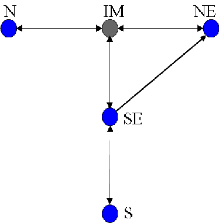

Figure 1: Case-study interconnected power system

The load of each area must be supplied by local hydro and thermal plants or by power flows among the interconnected areas. A slack thermal generator of high cost accounts for load shortage at each area. Interconnection limits between areas may differ depending of the flow direction. The energy balance equation for each sub-system has to be satisfied for each stage and scenario. There are bounds on stored and generated energy for each sub-system aggregate reservoir, on thermal generations and on area interchanges.

The objective function of the planning problem is to minimize the expected cost of the operation along the 120 months planning horizon, while supplying the area loads and obeying technical constraints. The total cost is the sum of thermal generating costs plus a penalty term that reflects energy shortage.

A scenario tree consisting of 1 × 200 × 20 × 20 × ··· × 20 scenarios, for 120 stages, was sampled based on a simplified statistical model provided by ONS. In this (seasonal) model, a 3-parameter Log-normal distribution is fitted to each month and for every system. The scenario tree is generated by sampling from the obtained distributions using a Latin Hypercube Sampling scheme. The input

data for the simplified statistical model is based on 78 observations of the natural energy inflow (from year 1931 to 2008) each year containing 12 months data for each of the considered 4 systems.

The numerical experiments were done using several different datasets. The case’s general data, such as hydro and thermal plants data and interconnections capacities were taken as static values through time. The demand for each system and the energy inflows in each reservoir were taken as time varying. To generate the cases, different demand values for each stage and SAAs were used. The main purpose of considering different datasets for the numerical experiments was to make the methodological conclusions not dependent on a particular dataset.

## 4 Stopping criteria and validation of the optimality gap

The current procedure for stopping the iterations (stopping criterion) is when the lower end of 100(1 α)% confidence interval (2.11), constructed by the forward step procedure at a given iteration of the algorithm, becomes smaller than the corresponding lower bound (step 2 of the SDDP algorithm description in the Appendix). This stopping criterion depends on the number of scenarios used in the forward step and the chosen confidence level 100(1 α)%. Reducing the number of scenarios results in increasing the standard deviation of the corresponding estimate and hence making the lower end of the confidence interval smaller. Also increasing the confidence level makes the confidence interval larger, i.e., decreases its lower end. This indicates that for sufficiently large confidence level the algorithm could be stopped at any iteration and this stopping criterion does not give any reasonable guarantee for quality of the obtained solution and could result in a premature stop of the iteration procedure.

It makes more sense to use the upper end of 100(1 α)% confidence interval, i.e., to use the upper bound (2.9). The upper end of the confidence interval gives an upper bound for the optimal value of the SAA problem with confidence (probability) 100(1 α/2)%. At the same time the backward step gives a lower bound for the optimal value of the SAA problem (this lower bound is based on all scenarios of the SAA problem and does not involve sampling of the tree of the SAA problem). The difference between these two bounds gives an estimate, with confidence 100(1 α/2)%, of the optimality gap of the corresponding policy. If this difference is smaller than a specified accuracy level ε > 0, then the procedure could be stopped.

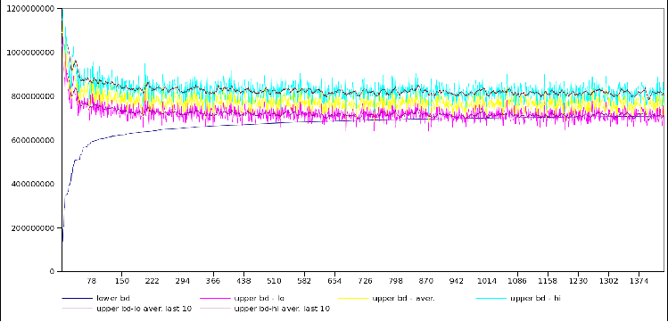

Figure 2: 120 stages, 1 cut per iteration and 95% upper bound estimation with 100 scenarios

|last iter.  |lower bounds (103)|upper bound 95% C.I. ub lo ub average ub hi (103) (103) (103)  |CPU time with ub-100 (sec)|CPU time no ub-100 (sec)  |
|---|---|---|---|---|
|1433  |710,197.84|718,347.32 772,773.32 827,199.32  |241,493.96  |25,796.69|

Table 1: SDDP bounds status at iteration 1433 and CPU time

Table 1 shows the bound status of the SDDP algorithm with 1 cut per iteration after 1433 steps. In column 4 there is the CPU time (in seconds) needed to run the algorithm with 1 cut per iteration but with upper-bound estimation at each step using a sample of 100 scenarios (with ub-100). The last column shows the CPU time needed for the algorithm to run with 1 cut per iteration without the upper bound estimation (no ub-100).

For large problems the optimality gap computed by the above procedure could never become sufficiently small in a reasonable computational time (see Figure 2 and Table 1). Therefore some other stopping criteria should be considered. Computational experiments indicate that during first iterations there is a quick improvement in values of lower and upper bounds, while after a certain iteration there is no significant improvement in the lower bound (the lower bound is monotonically increasing since no cuts are discarded in the current implementations). It makes sense to stop the algorithm at such an iteration since additional computations are wasted without a significant improvement of the computed solution (see Section 4.2 ). It should be remembered that an SAA problem is just approximation of the “true” problem and it does not make sense trying to solve it with a high accuracy. The computed cuts generate a policy for the true problem and value of that policy is of the real interest.

### 4.1 Lower bound and gap based stopping criteria

In this section we discuss stopping criteria for solving the constructed SAA problem. As it was discussed in Section 4 there are two possible approaches to stopping criteria: (i) by considering the gap between the lower and upper bounds generated by the SDDP algorithm, (ii) by stopping the procedure after the lower bound starts to stabilize.

We consider here a harder problem (larger gap value) than the one in the previous sections. It was obtained by increasing the demand values in the dataset. The global settings are the same: 120 stages and a scenario tree with the same structure: 200 realizations in the second stage and 20 for later stages.

We run the SDDP algorithm with 1 cut per iteration. Since in such implementation there is only one run of the forward procedure at every iteration of the algorithm, we cannot compute the respective upper bounds by averaging values of the estimated costs at every iteration. What we can do, however, is to average the estimated costs over the iterations. In our experiments we used the past 100 observations over iterations. After a while the procedure starts to stabilize and this approach to computing statistical upper bounds worked as well.

Figure 3 shows the bounds (the upper and lower ends of the computed confidence interval) behavior for the performed experiment. Table 2 summarizes the CPU time needed to achieve some reference iterations. It could be observed that even after three thousands iterations there is a considerable gap between the upper and lower bounds. Recall that the lower bound (of the SAA problem) is not stochastic and, since all cuts are retained, is monotonically increasing with the iterations.

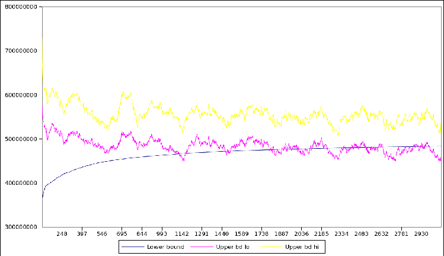

Figure 3: Bounds evolution for SDDP applied to SAA

|iteration  |CPU time (sec)|
|---|---|
|1000  |24,142.06|
|1500  |59,886.96|
|2000  |90,836.05|
|2400|122,413.94|
|2700  |150,262.37|

Table 2: CPU time for the algorithm at some iterations

#### 4.1.1 Lower bound/cpu-time based stopping criterion

Based on the decreasing rate of improvement of the lower bound, we define the best expected improvement of the lower bound if the algorithm runs for 1 more hour as follow:

3600 (cpuk cpuk 100)

(lbk lbk 100) lbk

The first ratio corresponds to the relative amount of improvement of the lower bound over the past 100 iterations. The second element of the product corresponds to the inverse of the CPU time in hours needed to perform these 100 iterations.

We plot the criterion behavior starting from iteration 1000 in Figure 4. Stopping the algorithm when this criterion is less than 0.2% for 100 consecutive iterations corresponds to iteration 1149. In this particular instance, this stopping criterion leads somehow to a relatively early termination. This is mainly due to the fact that there is a sudden decrease of the rate for more than 100 consecutive steps around iteration 1000.

This stopping criterion is realistic when the settings are chosen correctly but it is not coherent. Indeed, it does not lead to the same stopping time when run in different machines. Thus, it is highly dependent on the machine configuration and it might not be a judicious choice of a stopping criterion.

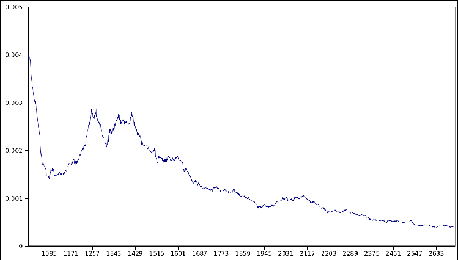

Figure 4: Lower bound/cpu-time criterion evolution starting from iteration 1000

#### 4.1.2 Gap based stopping criterion

We consider the gap between the upper bound given by the upper end of the confidence interval and the lower bound computed in backward steps of the algorithm, that is ubhi lb. Figure

- 5 illustrates the behavior of the gap. We can see that in the beginning the gap improvement decreases significantly. After iteration 1000, the gap does not change in a remarkable way. The main observation is that, clearly, it does not make sense to consider zero gap as a stopping criterion. Figure 6 illustrates the smoothed gap by taking the average over 10 and 50 last iterations.

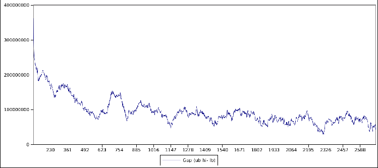

Figure 5: Gap evolution over iteration

In our experiments we estimate the upper bound at each iteration by taking the past 100 observations over iterations. Doing so allows us to approximate the gap without the significant computational effort of running at each iteration a large number of forward sample paths. The underlying justification is that in later stages (after iteration 1500) the lower bound does not

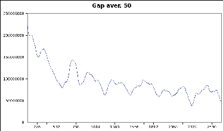

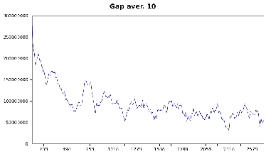

Figure 6: Smoothed gap

improve significantly (i.e. the constructed policy does not change significantly). Table 3 shows the absolute value of the gap and the relative value to the lower bound at some iterations.

|iteration|lower bd value  |gap  |gap aver 10 (% of lb)  |gap aver 50 (% of lb)|CPU time (sec)  |
|---|---|---|---|---|---|
|1000  |463,347,670.01|96,409,279.90  |23.0%|21.0%  |24,142.06|
|1500  |472,272,166.37|59,270,087.96  |13.3%|12.0%|59,886.96|
|2000  |477,127,949.10  |69,758,776.80|15.0%  |15.3%|90,836.05|
|2400  |480,243,297.61|67,675,418.58  |13.5%  |13.4%|122,413.94|
|2700|481,902,400.07  |55,133,706.27  |10.3%|10.8%|150,262.37|

Table 3: Gap value and averaged gap at some iterations

The gap based stopping criterion is more rigorous and coherent criterion. However, in order to be defined appropriately we need to define an acceptable gap that is estimated based on the real life significance of the variables.

### 4.2 Policy value stopping criterion

First, we should observe the evolution of the bounds for the SDDP algorithm on a scenario tree generated using a simplified statistical model developed for these experiments. Figure 7 shows this behavior along with some CPU time (sec) at some key iterations.

We should mention that the upper bound is approximated (starting iteration 150) by taking as observations the past 100 output of the forward step with 1 cut. We plot also the cumulative average of the obtained UB observations with reference iteration 2401 and starting from iteration 2500 and above. It does not make sense to stop the algorithm before iteration 1000 since the lower bound is not yet stabilized.

Table 4 shows the 95% confidence interval for the cumulative upper bound confidence interval (with reference iteration 2401) at some key iterations along with the lower bound value. Table 5 summarizes the lower bound improvement with reference value at iteration 1000.

In order to have an idea about whether running further the algorithm starting from iteration 1000 is significant or not, we perform the following experiment:

- • in the beginning generate a set of 100 sample scenarios which will be our reference sample
- • run the SDDP algorithm instance and starting from iteration 1000 evaluate the policy value for the reference sample each 50 iterations
- • we perform a t-test on each of the differences to know whether there is a significant change in the mean or not with the progress of the algorithm

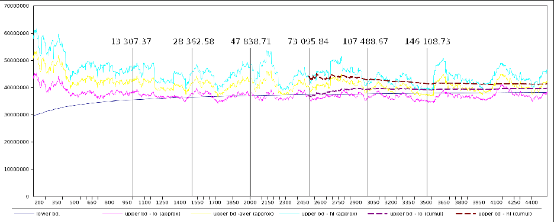

Figure 7: 120 stages, 1 cut per iteration

|Iteration  |lower bound  |Cumulative UB 95% C.I. lower average upper|
|---|---|---|
|2500|37,405,980.10  |37,053,025.93 40,637,351.88 44,221,677.83|
|3000  |37,687,552.12  |39,384,328.02 41,193,252.60 43,002,177.17|
|4000|38,087,973.45  |39,378,547.73 40,334,414.16 41,290,280.58|
|4500  |38,227,398.09  |39,723,070.72 40,539,347.49 41,355,624.26|

Table 4: Cumulative UB confidence interval (Ref. iter. 2401)

|Iteration range  |lb relative improvement  |CPU time (sec)|
|---|---|---|
|1000-1500|0.0278  |15055.21|
|1500-2000|0.0158  |19476.13|
|2000-2500  |0.0106|25257.13|
|2500-3000  |0.0079  |34392.83|
|3000-3500  |0.0063|38620.06|
|3500-4000  |0.0050|41745.24|
|4000-4500  |0.0039|45534.91|

Table 5: Lower bound improvement (Reference lb1000)

The null hypothesis is that the difference between mean values of the considered policies is 0 against the alternative that it is bigger than 0. The result of the test is a rejection of the null hypothesis at the 5% significance level if the p-value is less than 5%. Figures 8 and 9 give the evolution of the p-value for different t-test results with respect to one reference sample at some chosen iterations. When the reference iteration is 1000, we can see that starting from iteration 1400 we reject the null hypothesis at 5% significance level almost all the time. Therefore stopping the algorithm at iteration 1000 may be premature. Also, we can see from Table 5 that running further the algorithm for 4 more hours will result in approximatively

- 3% improvement of the lower bound.

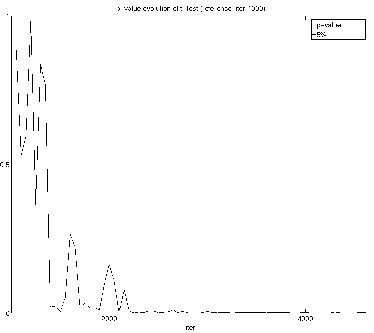

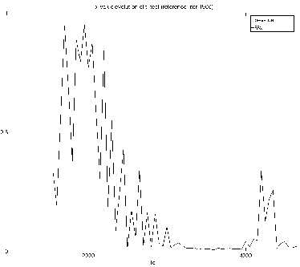

- Figure 8: p-value evolution with reference iteration 1000 and 1500

Similarly, we can see that when the reference iteration is 1500, we reject the null hypothesis at 5% significance level starting iteration 3000 most of the time. Thus, it might not be a suitable time to stop the algorithm at this level. When the reference iteration is 2000, we can see that we cannot

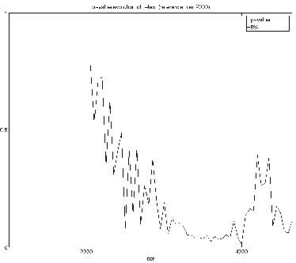

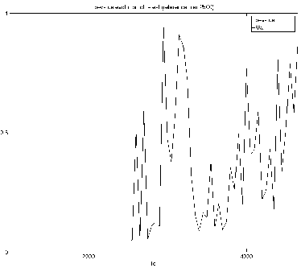

- Figure 9: p-value evolution with reference iteration 2000 and 2500

reject the null hypothesis at the 5% significance level most of the time. We believe that this level might be a reasonable stopping time for the algorithm. This is even more evident starting from iteration 2500. In other words, running further the algorithm will be computationally expensive and will not improve significantly the policy constructed so far.

### 4.3 Parallel SDDP

The SDDP algorithm is the ideal setting for using parallelization techniques. When we combine the forward and backward step for each trial solution, we can run this process in parallel and obtain multiple cuts per iteration in a reasonable time. Figure 10 illustrates the implementation.

Master machine: (I) Sends the current cuts Qt

| | |
|---|---|
| | |

Machine 1: Forward+Backward step & goto (II)

Machine M Forward+Backward step & goto (II)

... ...

Master machine: (II)Update Qt & goto (I)

Figure 10: Diagram for parallel implementation

The main task of Master machine is to coordinate the parallel runs: It sends the current outer approximation of the cost-to-go functions to all the other machines in the pool. Then, each machine runs one forward step followed by the corresponding backward iteration and sends back the obtained cuts to the Master machine. The Master machine collects all the cuts from all the machines, updates the approximation of the cost-to-go functions and performs the same procedure again. There are several packages to handle the parallelization scheme. In our implementation we used OpenMPI library.

We run the Parallel SDDP algorithm with 80 machines (79 cuts per iteration). Figure 11 shows the bounds evolution VS CPU time.

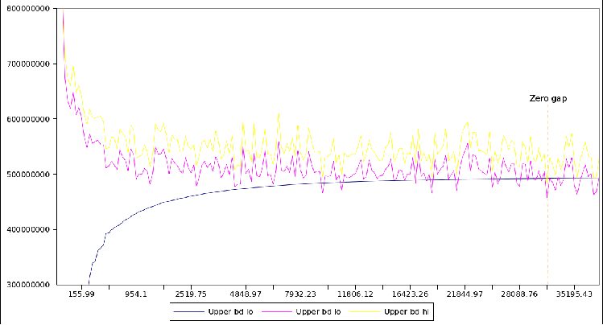

Figure 11: Bounds evolution for Parallel SDDP with 80 machines

We can see that the r.h.s. of the confidence interval for the upper bound estimated over a sample of size 79 goes below the lower bound after 31514.81 sec. (8.75 hours) of running the algorithm. The algorithm stops at iteration 180 after adding 14220 cuts.

## 5 Number of cuts per iteration

The forward step of the SDDP algorithm has two functions. Namely, it generates trial points for the consequent backward step of the algorithm, and it is used to compute an upper bound for the optimal value of the SAA problem. From these two functions the first one is more important. So a natural question is how many cuts per iteration should be added in the backward step of the algorithm. Adding more cuts makes a better improvement per iteration but at the same time increases computational complexity of every iteration. Computational experiments indicate that adding cuts corresponding to one forward scenario is a better approach. At the same computational time it produces a better lower bound as compared with the approach of many forward scenarios (see Tables 6 and 7).

|Num. of cuts/iter  |last iteration  |lower bound|CPU time (sec)  |
|---|---|---|---|
|1|1090  |704,287,220.60|16,057.53|
|2  |557|704,271,362.79  |19,539.52|
|5|223  |704,235,083.66  |18,911.08|
|10  |118|704,373,788.54|18,125.09|
|50|32  |704,240,867.23|32,434.97|

Table 6: SDDP performance to achieve a fixed lower bound

|Num. of cuts/iter|last iteration  |lower bound|CPU time (sec)  |
|---|---|---|---|
|1  |1500  |712,748,368.91|27,952.78|
|2  |750|712,408,983.66  |32,619.13|
|5|300  |712,490,474.14|31,608.56|
|10|150  |711,364,791.72|27,813.52|
|50  |30|702,604,065.10  |28,985.40|

Table 7: SDDP performance after adding the same number of cuts

This behavior was further investigated with another data set for the same hydrothermal configuration. Figure 12a shows the lower bound achieved considering 1, 10, 25, 50, 100, 200, 1500, 3000 fixed number of cuts added at each iteration. It is clear that, with fewer cuts added, smaller forward numbers gives a much better result. If one plans to run the SDDP algorithm adding between 1 and about 100 cuts, it seems better to use one forward scenario per iteration, whereas between 100 and about 300 it seems better to use 10 forwards. From this value on, 25 forward scenarios appears as a better choice until about 800 cuts are added, and so on. Figure 12b shows the CPU time spent by the total number of cuts added, where one can see that, except for very large forward numbers (1500 and 3000), there weren’t big differences in the CPU times among runs. (Caveat: as these results came from a single run of each forward number choice and express a typical behavior, the mentioned values merely illustrate this behavior, and almost certainly would change if another run is done.) Running 400 iterations with 1 forward scenario at each SDDP iteration takes about 830 seconds and reaches a lower bound value of approximately $420 × 106. The 200 forward scenarios choice takes 1150 seconds to complete two iterations (amounting to the same total of 400 added cuts), but the lower bound value remains at the same value of the first iteration (without any cut). Observe that the 200 forward scenarios option takes 6 iterations (about 5800 seconds) to reach a

##### value near $420 × 106. In summary, with a small budget of total added cuts, a smaller number of forward scenarios gives better results. On the other hand, if one opts to have a large total number of cuts, a larger forward sample size may attain better results.

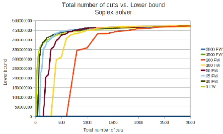

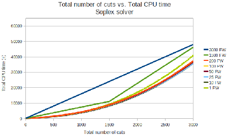

(a) Lower bound (b) CPU time

Figure 12: SDDP performance — fixed number of added cuts per iteration

This suggests that a strategy of increasing the number of forward scenarios during the iteration process could give better results than the fixed number strategy: use a small number of forward scenarios during the first iterations, in order to achieve higher values for the lower bound in short CPU time, and increase the number of forward scenarios in subsequent iterations. For instance, if 400 iterations are done with 1 forward scenario and then the forward scenarios number is increased to 200, one expects that the results after adding a total of 3000 cuts would be better than the results taking a fixed number of forward scenarios along all iterations.

|Strategy  |Iteration  |Cuts/iter|
|---|---|---|
|FW 1  |001-150 151-175 176-195 196-203 204-216 217-218|1 10 25 50 100 200  |
|FW 2  |001-200 201-214|1 200  |
|FW 3  |001-400 401-413|1 200  |
|FW 4  |001-016 017-029  |25 200|

Table 8: Strategies for increasing the number of forward scenarios

To evaluate this idea, the four additional strategies shown in table 8 were considered. Strategy “FW 1” corresponds to increase the forward number by the iteration when it becomes indifferent to change from the current number of forward scenarios to the next (greater) one when the lower bounds are similar. In this way, one expects that the lower bound increases like the best available case shown in figure 12. The other three strategies correspond to try to reach higher lower bounds with smaller CPU time and, then, increase the number of added cuts per iteration. With this

approach, one expects to reach a higher lower bound at the end of the iteration process.

The results in figures 13a and 13b show that strategies “FW 2”, “FW 3” and “FW 4” can lead to higher lower bound values with less added cuts. Moreover, in about 1/10 of the CPU time associated with the 3000 cuts lower bound estimation, the lower bounds achieved around 600 added cuts using strategies “FW 2” and “FW 3” are practically the same and equal to the one associated with the 3000 cuts value.

These are promising results and further studies need to be done to investigate the improvement in the problem solution.

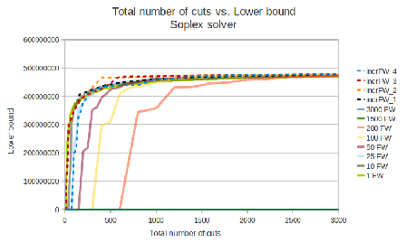

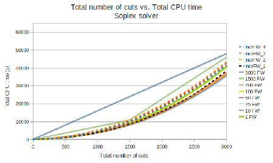

(a) Lower bound (b) CPU time

Figure 13: SDDP performance — variable number of added cuts along iterations

## 6 Impact of the total number of stages

In the current setting problems with 120 stages are considered. Only first and second stage solutions are actually used for practical purposes and only first 60 stages are used for planning purposes. The solutions are updated as new information (realizations of the random data) becomes available. This raises the question of value of trying to compute with so many stages, which of course consumes considerable computational resources. This is certainly a question which requires a careful investigation.

We run the SDDP algorithm for 2000 iterations with a total number of stages T = 70, 80, 90, 100, 110 and 120. Then, we evaluate the policy value for 60 stages by running a forward step with 100 scenarios. Table 9 summarizes the obtained 60 stages policy value for the different total horizon considered. Similar time to perform the first iteration indicates similar machine performance.

|total stages  |last iter.|upper bound 95% C.I. ub lo ub average ub hi  |CPU time (sec)|CPU time iter 1  |
|---|---|---|---|---|
|70|2000|98,112,217.60 108,167,447.77 118,222,677.95  |66,222.52|30.68|
|80  |2000  |112,518,914.84 122,474,298.59 132,429,682.35  |59,864.13|8.15|
|90|2000  |128,189,646.47 136,975,708.56 145,761,770.66  |76,712.00|24.14|
|100|2000|140,620,138.07 148,390,099.31 156,160,060.55  |92,491.40|43.59|
|110  |2000|152,308,316.49 159,101,656.39 165,894,996.29|80,894.59  |9.40|
|120|2000  |152,699,397.71 160,685,840.33 168,672,282.95|87,241.15  |10.23|

Table 9: Policy value for 60 stages at termination for different total number of stages

Working with a total number of stage of 120 is not reasonable. Indeed, it is not possible to predict accurately over a horizon of 10 years in the future. Also, reducing the total number of stages allows us to gain in the CPU time on average.

The main question here is: What would be a reasonable total number of stages? Clearly, no definitive answer exists. The main idea behind considering such total horizon (10 years) for a target study of 5 years is to take into account the fact that after these five years the system is going to continue to operate and not stop. Thus, we have to take this fact into consideration in the optimization process.

Now, the period of 61–120 is just a device to provide the boundary condition for the infinite horizon problem. Exploratory analysis of the results indicate that SDDP algorithm apparently finds the solution for the last stages earlier than for the initial ones. One possible reason for this behavior can be given by the fact that the boundary condition for stage 120 is fixed and equal to zero for all iterations.

Therefore, a possibly promising approach to reach a solution in smaller CPU times is to split the 120 stages problem in two, and solve initially the subproblem associated to stages 61 to 120, with null cost-to-go function at stage 120. Aiming to estimate the cost-to-go function for stage 61 with a more comprehensive set of states, one may start the solution with fixed initial stored volumes at a previous stage, such as the 48-th stage, and then solve the 48–120 problem and use the cost-to-go function for the stage 61 as the fixed boundary condition to solve the subproblem associated with stages 1–60. This approach could lead to a better solution for the period of interest,

- as the 1–60 stages problem would be solved after its boundary condition (end of the 60-th stage) is well estimated. Moreover, it can be computationally more efficient to solve two smaller problems.

## 7 Policy evaluation for the true problem

So far the cost of the generated policy was evaluated by the forward step procedure employing resampling from the scenario tree of the considered SAA problem. However, we are really interested in the cost of this policy for the true problem. In that respect we perform the following experiment:

- • Run the SDDP algorithm on an SAA problem with 1 cut per iteration and save the constructed cuts at each iteration.
- • Based on the obtained cuts we compute every 10 iterations the policy value based on a sample of 100 scenarios generated from the scenario tree.

- Figure 14 shows the evolution of the upper bound confidence interval for the algorithm when

we use the SAA scenario tree and when we generate sample paths from the true distribution. We should recall that these values were computed each 10 iterations over a sample of 100 scenarios.

- Figure 15 shows the evolution of the average of the last 10 observations ( the last 10 observations

cover 100 iterations with a step of 10). As expected, we can see that the confidence interval obtained from the true distribution is most of the time higher than the one obtained from the SAA scenario tree.

## 8 Simple cut-removal strategies

In the current implementations no cuts are discarded in the iteration process. Intuitively it seems reasonable to assume that after a while some cuts become redundant, these cuts do not contribute

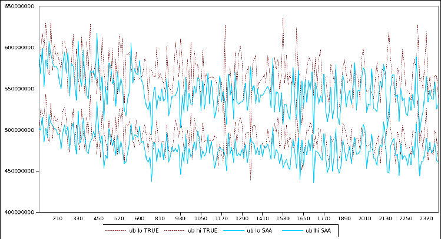

Figure 14: Upper bound C.I. from true distribution VS from scenario tree

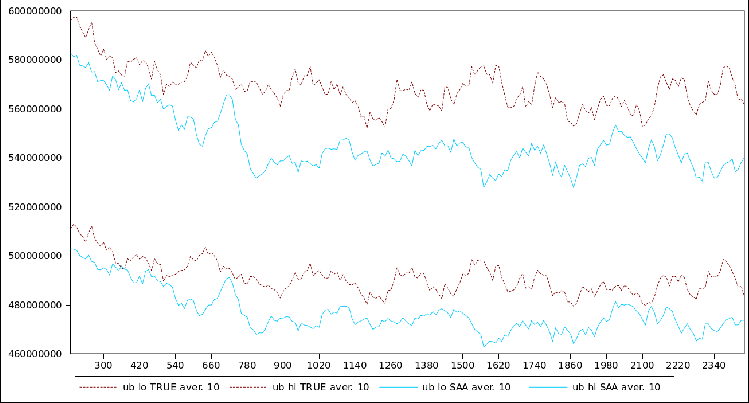

Figure 15: Average last 10 observations U.B. C.I. from true distribution VS from scenario tree

to improvements of the solutions while consuming computational resources. Unfortunately it is not obvious what would be a good strategy for discarding “redundant” cuts.

We investigated empirically a simple cut removal strategy that consists in keeping a fixed number of recently generated cuts. We run the algorithm with the same seed for:

- • instance with all cuts
- • instance with keeping a fixed number of cuts (200,300,...,1000)

First, to clarify the CPU time variability that we face sometimes in our results, we consider the time needed for each of the instances to perform the first iteration as an indicator for similar machine performance. Theoretically, we should have the same CPU time since we start with the

same seed and run on the same machines. However, in reality we have some variability in CPU time. This issue is caused by the fact that we don’t have dedicated machines for our experiments. Indeed, these machines have the same configuration but in reality they are running multiple jobs

- at the same time. Hence, depending on the workload they have, we get part of the total possible resource. Table 10 shows the CPU time needed to perform the first iteration for the different experiments.

|kept cuts  |CPU time (sec) for iteration 1| |kept cuts  |CPU time (sec) for iteration 1|
|---|---|---|---|---|
|200  |15.16| |700  |15.34|
|300  |22.34| |800  |22.92|
|400  |15.42| |900|10.73|
|500|22.76| |1000  |23.76|
|600  |10.32| |All|14.08|

Table 10: CPU time to perform the first iteration

Taking this fact into account, we will present the results by the comparable scale for the CPU time:

- • 200, 400, 700 and All
- • 300, 500, 800, 1000
- • 600, 900

Tables 11, 12 and 13 summarize the obtained results when we stop the algorithm after 3200 iterations for all instances. It is interesting to observe that there is a significant CPU time improvement with relatively good quality results: there is no significant difference in quality of the lower and upper bounds while keeping all cuts and, say, last 200-300 cuts However, it is still not yet obvious what would be a reliable strategy for discarding “redundant” cuts.

|kept cuts  |Last iter|lower bound  |upper bound 95% C.I. ub lo ub average ub hi  |CPU time (sec)|
|---|---|---|---|---|
|200  |3200  |483,689,064.97|460,069,731.55 490,787,423.90 521,505,116.25  |106,060.50|
|400  |3200|483,827,380.35  |460,223,857.80 490,411,069.62 520,598,281.44|123,105.10|
|700  |3200|483,875,859.44  |460,375,309.58 490,695,093.84 521,014,878.09|146,688.68|
|All|3200  |483,885,962.15|458,352,813.09 488,566,256.03 518,779,698.98  |217,038.20|

- Table 11: SDDP bounds status after 3200 iterations with new dataset

|kept cuts|Last iter  |lower bound|upper bound 95% C.I. ub lo ub average ub hi  |CPU time (sec)|
|---|---|---|---|---|
|300  |3200  |483,892,385.05|459,400,268.04 489,844,077.02 520,287,885.99  |114,542.63|
|500|3200|483,852,350.40  |459,207,194.53 489,650,197.54 520,093,200.55|126,541.05|
|800|3200  |483,863,400.52|459,019,596.44 489,469,496.34 519,919,396.24|143,193.63|
|1000|3200|483,894,453.14  |458,786,265.82 489,055,258.28 519,324,250.73|164,809.76|

- Table 12: SDDP bounds status after 3200 iterations with new dataset

In the ensuing text, another cut elimination procedure was investigated, in which the set of kept cuts consists of the union of any active cut (i.e., cut with simplex multiplier different from

|kept cuts  |Last iter|lower bound  |upper bound 95% C.I. ub lo ub average ub hi|CPU time (sec)  |
|---|---|---|---|---|
|600  |3200  |483,921,247.51|458,573,217.96 488,977,638.29 519,382,058.61  |99,306.59|
|900|3200  |483,947,973.83|459,806,028.81 490,384,881.40 520,963,733.99  |119,810.66|

Table 13: SDDP bounds status after 3200 iterations with new dataset

zero) in any LP solved in the previous N iterations (either in forward or backward procedure) and all generated cuts along the last N iterations. In other words, in this procedure at least all cuts calculated in the previous N iterations are considered to be used in the next SDDP iteration as well as every cut calculated in earlier iterations that are still being used by the SDDP algorithm. The computational implementation of this procedure is simple and pose no significant additional CPU effort during the iterations of the SDDP algorithm.

The proposed cut elimination strategy was numerically evaluated with the aid of the following case studies:

- • all cuts No cut elimination procedure was done. 200 forward scenarios were used in each iteration, and 100 iterations were performed, that is, the algorithm proceeds until 20,000 cuts were added to each stage. This is taken as the benchmark case.

- • 1 iter cuts Keep only the cuts used in the last iteration. It was used 200 forward scenarios in each iteration, 119 iterations were performed, that is, a total of 23,800 cuts were calculated for each stage.

- • 2 iter cuts Keep the cuts used in the last 2 iterations. It was used 200 forward scenarios in each iteration, 236 iterations were performed, that is, a total of 47,200 cuts were calculated for each stage.

- • 3 iter cuts Keep the cuts used in the last 3 iterations. It was used 200 forward scenarios in each iteration, 143 iterations were performed, that is, a total of 28,600 cuts were calculated for each stage.

- • 1FW 200 iter cuts Keep the cuts used in the last 200 iterations, considering 1 forward scenario in each iteration until 20,000 iterations were performed, that is, the algorithm proceeds until a total of 20,000 cuts were added to each stage. After the 20,000-th iteration, the forward scenario number was increased to 200 and 50 additional iterations were run (10,000 additional cuts were added to each stage). In this second run, only the cuts used in the last iteration were kept.

- • incrFW 1 iter cuts In this case 400 iterations were run with 1 forward scenario, keeping the cuts calculated in the last 200 iterations. After that, the forward scenarios number was increased to 200 and 98 additional iterations were run keeping the cuts used in the last iteration.

Figure 16 shows the lower bound value for each number of calculated cuts. It can be seen that keeping the cuts used in the last 3 or 2 iterations gives a lower bound very close to the one calculated when no cuts are discarded, while keeping the cuts used just in the last iteration, on the other hand, results in a smaller lower bound. As shown in section 5, running the SDDP with only

one forward scenario at each iteration can make the lower bound increase rapidly in the beginning, but the achieved lower bound for a higher number of iterations is smaller when compared with the other strategies. Therefore, start the iterative process with 1 forward and then increase its number seems to be a good idea to be used together with the cut elimination procedure, as shown by the “incrFW 1 iter cuts” results. Although in this case only the cuts used in the last iteration are kept, in further studies we should use this forward sampling strategy and keep the cuts used in the last

- 2 iterations (if the chosen forward number is 200 and the problem is of the same kind and size). This is a general suggestion, the scenarios number and iterations to keep cuts may vary depending on the problem and scenarios tree being used.

|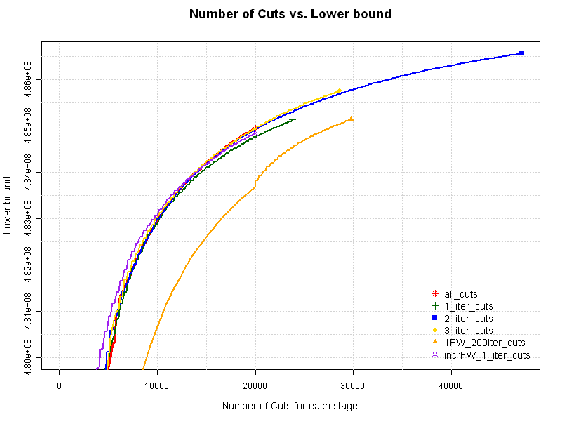|
|---|

Figure 16: Lower bound value vs. the total number of cuts calculated by SDDP algorithm

- As shown in figure 16, the described procedure seems to solve the problem appropriately when

the lower bounds are compared with the benchmark case. However, this procedure would be worthless without a significant improvement in the CPU solution’s time. Figure 17 shows the CPU total running time by the number of calculated cuts for each stage. In this figure, it is clear that for the same number of added cuts, the benchmark case consumes more CPU time than the cases associated with the proposed strategy: for instance, considering 20,000 added cuts the “3 iter cuts” CPU time is 5 times smaller, while the “2 iter cuts” running time is 7 times smaller.

- At this point it is interesting to make a comment regarding the expected growth in CPU

time for these cut discarding strategies. Suppose a scenarios tree with NT innovations at each stage, and a forward sampling strategy that uses NF forward scenarios. This means that, at each iteration, NF cuts are calculated at each stage, and, without removing cuts, one should have NumCutsall = I × NF cuts for each stage at the end of the current iteration I. When the cut removal procedure takes place keeping just the cuts used in the last N iterations, at iteration I each stage LP is going to have at least N × NF cuts, but not more than NumCutsredcuts = (N × NF) + N × (NF + NF × NT), where (N × NF) are the cuts used by the forward procedure in the last N iterations and N × (NF + NF × NT) is total number of cuts calculated and used in the backward procedure in the last N iterations. Of course NumCutsredcuts can be slightly higher if more than one cut becomes active in the same LP. On the other hand, it can happen that the some LPs use cuts already used in the same iteration, resulting in a decrease on the number of

the preserved cuts. The important point here is that the LP maximum size does not increase with the iteration number I. In other words, each stage LP has a maximum size (NumCutsredcuts) and, therefore, the total CPU time starts to increase linearly after many iterations. The correct choice of N is closely related to the choice of NF. A small NumCutsredcuts makes it difficult to accurately represent the problem, and the solution might be compromised. On the other hand, if NumCutsredcuts is too large, the decrease in the CPU time can be very small.

|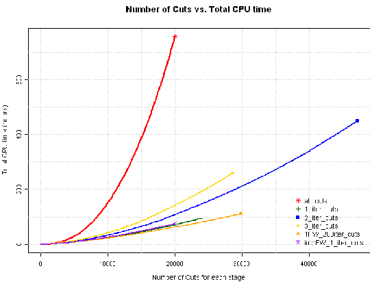|
|---|

Figure 17: CPU total time vs. the total number of cuts calculated by SDDP algorithm

## 9 Conclusions

This report concludes the first phase of the project. Various approaches to stopping criteria were investigated. The lower bound based stopping criterion, discussed in section 4.1.1, is realistic when the settings are chosen correctly, but it is not coherent. Indeed, it does not lead to the same stopping time when run in different machines. Thus, it is highly dependent on the machine configuration and it might not be a judicious choice of a stopping criterion.

The gap based stopping criterion, discussed in section 4.1.2, is more rigorous and coherent criterion. However, in order to be defined appropriately we need to define an acceptable gap that is estimated based on the real life significance of the variables. For larger problems this gap may never become acceptably “small” in a reasonable computational time. The “policy value” stopping criterion, discussed in section 4.2, could be a reasonable compromise for larger problems.

Clearly using parallelization techniques with the SDDP algorithm helped, sometimes significantly, in achieving convergence in a reasonable time.

As far as the number of cuts per iteration is concerned it appears that a best strategy is to start with a small number of cuts, while the lower bound is rapidly increasing, and gradually to increase the number at the later iterations.

Cut removal strategies, discussed in section 8, were quite efficient and helped to significantly decrease the computational time without compromising quality of the computed solutions.

## References

[1] Shapiro, A., Analysis of Stochastic Dual Dynamic Programming Method, European Journal of Operational Research, vol. 209, pp. 63-72, 2011.

## A Appendix – SDDP algorithm

|Initialization: Qt = {0} for t = 2,...,T + 1 and ¯z = ∞|
|---|
|Step 1: Prepare M trial decision for each stage Sample M random data scenarios from true distribution For k = 1,...,M  [¯xk1,αk2] = arg min c1x1 + α2 s.t. A1x1 = b1,α2 ∈ Q2,x1 ≥ 0  For t=2,...,T-1,T [¯xkt,αk(t+1)] = arg min ˜ctkxt + αt+1 s.t. Atkxt = btk Btk¯xkt 1,[xt,αt+1] ∈ Qt+1,xt ≥ 0 End For  End For  |
|Step 2: Backward recursion and lower bound update For k=1,...,M  For t=T,T-1,...,2 For j = 1,...,Nt Qtj(¯xkt 1) = min ˜ctjxt + αt+1 s.t. Atjxt = btj Btj¯xkt 1 (˜πktj : dual variable)  [xt,αt+1] ∈ Qt+1,xt ≥ 0 End For  Qt(¯xkt 1) := 1Nt  Nt j=1 Qt,j(¯xkt 1) ; ˜gkt := 1Nt  Nt j=1 Bt,j˜πktj  Qt ← {[xt 1,αt] ∈ Qt : ˜gkt 1  xt 1  αt ≥ Qt(¯xkt 1) ˜gkt¯xkt 1} End For  End For z = min c1x1 + α2 s.t. A1x1 = b1  α2 ∈ Q2,x1 ≥ 0  |
|Step 3: Forward simulation and Upper bound update Sample M random data from true distribution/Sampling with replacement For k = 1,...,M  [¯xk1,αk2] = arg min c1x1 + α2 s.t. A1x1 = b1,α2 ∈ Q2,x1 ≥ 0  For t=2,...,T-1,T [¯xkt,αk(t+1)] = arg min ˜ctkxt + αt+1 s.t. Atkxt = btk Btk¯xkt 1,[xt,αt+1] ∈ Qt+1,xt ≥ 0 End For ϑk ← c1¯xk1 + Tt=2 ˜ctk¯xkt  End For ¯ϑ ← 1M Mk=1 ϑk and ˆσ2ϑ ← 1M 1  M k=1 (ϑk ¯ϑ)2  z = ¯ϑ + zαˆσϑ/  √  M. If (z z ≤ ); STOP!; Otherwise go to Step 2.  |

