European Journal of Operational Research 224 (2013) 375–391

Contents lists available at SciVerse ScienceDirect

# European Journal of Operational Research

journal homepage: www.elsevier.com/locate/ejor

Decision Support Risk neutral and risk averse Stochastic Dual Dynamic Programming method Alexander Shapiro a,⇑, Wajdi Tekaya a, Joari Paulo da Costa b, Murilo Pereira Soares b

- a School of Industrial and Systems Engineering, Georgia Institute of Technology, Atlanta, GA 30332-0205, USA
- b ONS – Operador Nacional do Sistema Elétrico, Rua da Quitanda, 196, Centro Rio de Janeiro, RJ 20091-005, Brazil

article info

Article history:

Received 12 January 2012 Accepted 24 August 2012 Available online 5 September 2012

Keywords: Multistage stochastic programming Dynamic equations Stochastic Dual Dynamic Programming Sample average approximation Risk averse Average Value-at-Risk

abstract

In this paper we discuss risk neutral and risk averse approaches to multistage (linear) stochastic programming problems based on the Stochastic Dual Dynamic Programming (SDDP) method. We give a general description of the algorithm and present computational studies related to planning of the Brazilian interconnected power system.

2012 Elsevier B.V. All rights reserved.

1. Introduction

In this paper we discuss risk neutral and risk averse approaches to multistage (linear) stochastic programming problems based on the Stochastic Dual Dynamic Programming (SDDP) method. We give a general description of the algorithm and present computational studies related to operation planning of the Brazilian interconnected power system. The SDDP algorithm was introduced by Pereira and Pinto [6,7] and became a popular method for scheduling of hydro-thermal electricity systems. The SDDP method utilizes convexity of linear multistage stochastic programs and stagewise independence of the stochastic data process. It is based on building piecewise linear outer approximations of the cost-to-go functions and can be viewed as a variant of the approximate dynamic programming techniques. The distinguishing feature of the SDDP approach is random sampling from the set of scenarios in the forward step of the algorithm.

Almost sure convergence of the SDDP algorithm was proved in Philpott and Guan [8] under mild regularity conditions (see also [12, Proposition 3.1]). However, little is known about rates of convergence and computational complexity of the SDDP method. It is sometimes made a claim that the SDDP algorithm avoids ‘‘curse of dimensionality’’ of the traditional dynamical programming method. This claim should be taken carefully. An analysis of the SDDP algorithm applied to two stage stochastic programming indicates that its computational complexity grows fast with increase of the number of state variables (cf., [13, Section 5.2.2]), and this seems

⇑ Corresponding author. Tel.: +1 404 8946544.

E-mail address: ashapiro@isye.gatech.edu (A. Shapiro).

0377-2217/$ - see front matter 2012 Elsevier B.V. All rights reserved. http://dx.doi.org/10.1016/j.ejor.2012.08.022

to be confirmed by some numerical experiments. Therefore it appears that the SDDP method works reasonably well when the number of state variables is relatively small while the number of stages can be large.

Up to this point, the standard risk neutral approach was implemented for planning of the Brazilian power system. The energy rationing that took place in Brazil in the period 2001/2002 raised the question of whether a policy that is based on a criterion of minimizing the expected cost is a valid one when it comes to meet the day-to-day supply requirements. As a consequence, a shift towards a risk averse criterion is underway, so as to enforce the continuity of load supply. Several risk averse approaches to multistage stochastic programming were suggested in recent literature. Eichhorn and Römisch [2] developed techniques based on the so-called polyhedral risk measures. This approach was extended further in Guigues and Römisch [3] to incorporate the SDDP method in order to approximate the corresponding risk averse recourse functions. Theoretical foundations for a risk averse approach based on conditional risk mappings were developed in Ruszczyn´ski and Shapiro [10] (see also [11, Chapter 6]). For risk measures given by convex combinations of the expectation and Average Value-at-Risk, it was shown in [12] how to incorporate this approach into the SDDP algorithm with a little additional effort. This was implemented in an extensive numerical study in Philpott and de Matos [9].

This article is organized as follows. In the next section we discuss general methodological aspects of the stochastic programming approachwithfocuson the SDDPalgorithm.In Section3 we givea brief description of the SDDP algorithm. Risk averse approaches with various risk measures are discussed in Section 4. We design in that section a general and simplified (as compared with [12]) methodology

for implementation of the risk averse approach combined with the SDDP method. In Section 5 the Brazilian interconnected power system is introduced. In particular, a multiplicative times series model is suggested to deal with nonnegativity of the monthly inflows. The performance of the SDDP algorithm is illustrated with the aid of some numerical experiments and with emphasis on the Brazilian power system case in Section 6. Computational aspects of the algorithm’s convergence and solution stability are presented and discussed. Finally, Section 7 is devoted to conclusions.

2. Mathematical formulation and modeling

Mathematical algorithms compose the core of the Energy Operation Planning Support System. The objective is to compute an operation strategy which controls the operation costs, over a planning period of time, in a reasonably optimal way. This leads to formulation of (linear) large scale multistage stochastic programming problems which in a generic form (nested formulation) can be written as

2 4

Min A1x1¼b1 x1P0

cT1x1 þ E min B2x1þA2x2¼b2 x2P0

cT2x2 þ E½

2 4

3 5

3 5

3 5: ð2:1Þ

þE min BTxT 1þATxT¼bT xTP0

cTTxT

Components of vectors ct, bt and matrices At, Bt are modeled as random variables forming the stochastic data process nt =(ct, At, Bt, bt), t =2,...,T, with n1 =(c1, A1, b1) being deterministic (not random). By n[t] =(n1,...,nt) we denote the history of the data process up to time t.

It is often assumed in numerical approaches to solving multistage problems of the form (2.1) that the number of realizations (scenarios) of the data process is finite, and this assumption is essential in the implementations and analysis of the applied algorithms. In many applications, however, this assumption is quite unrealistic. In forecasting models (such as ARIMA) the errors are typically modeled as having continuous (say normal or log-normal) distributions. So one of the relevant questions is what is the meaning of the introduced discretizations of the corresponding stochastic process. We do not make the assumption of finite number of scenarios, instead the following assumptions will be made. These assumptions (below) are satisfied in the applications relevant for the Brazilian power system generation.

We make the basic assumption that the random data process is stagewise independent, i.e., random vector nt+1 is independent of n[t] =(n1,...,nt) for t =1,...,T 1. In some cases across stages dependence can be dealt with by adding state variables to the model. In particular, the following construction is relevant for the considered applications. Suppose that only the right hand side vectors bt are across stage dependent, while other parameters of the problem form a stagewise independent process (in particular, they could be deterministic). We are interested in cases where, for physical reasons, components of vectors bt cannot be negative. Suppose that random vectors bt follow pth order autoregressive process with multiplicative error terms:

bt ¼ et  ðl þ /1bt 1 þ   þ/pbt pÞ; t ¼ 2;...;T; ð2:2Þ

where vector l and matrices /1,...,/p are estimated from the data. Here e2,...,eT are independent of each other error vectors and such that with probability one their components are nonnegative and have expected value one, and a b denotes the term by term (Hadamard) product of two vectors. The multiplicative error term model

is considered to ensure that realizations of the random process bt have nonnegative values.

The autoregressive process (2.2) can be formulated as a first order autoregressive process

1

0

3

3

3

3

3

- 1
- 2

2

2

2

l 0 0

et 1 1

bt

/1 /2 /p 1 /p

I 0 00 0 I 00

- bt 1
- bt 2

; ð2:3Þ

þ

¼

C A

B @

7 5

7 5

7

7 5

7 5

6 4

6 4

6 4

6 4

- 5

- bt 1
- bt 2
- bt 3

bt p

2

6

- 4

0

00 I 0

bt pþ1

where 1 is vector of ones and I is the identity matrix of an appropriate dimension. Denote by zt the column vector in the left hand side of (2.3), and by t, M and U the respective terms in the right hand side of (2.3). Then (2.3) can be written as

zt ¼ t  ðM þ Uzt 1Þ; t ¼ 2;...;T: ð2:4Þ Consequently the feasibility equations of problem (2.1) can be written as

zt t Uzt 1 ¼ t M; Btxt 1 þ Atxt ¼ bt; xt P 0; t

¼ 2;...;T: ð2:5Þ

Therefore by replacing xt with (xt,zt), and considering the corresponding data process nt formed by random elements of ct, At, Bt and error vectors et, t =2,...,T, we transform the problem to the stagewise independent case. The obtained problem is still linear with respect to the decision variables xt and zt.

We consider the following approach to solving the multistage problem (2.1). First, a (finite) scenario tree is generated by randomly sampling from the original distribution and then the constructed problem is solved by the Stochastic Dual Dynamic Programming (SDDP) algorithm. There are three levels of approximations in that setting. The first level is modeling. The inflows are viewed as seasonal time series and modelled as a periodic auto-regressive (PAR(p)) process. Any such modeling involves inaccuracies – autoregressive parameters should be estimated, errors distributions are not precise, etc. We will refer to an optimization problem based on a current time series model as the ‘‘true’’ problem.

The ‘‘true’’ model involves data process nt, t =1,...,T, having continuous distributions. Since the corresponding expectations (multidimensional integrals) cannot be computed in a closed form, one needs to make a discretization of the data process nt. So a sample ~n1t; ; ~nN

t , of size Nt, from the distribution of the random vector nt, t =2,...,T, is generated. These samples generate a scenario tree with the total number of scenarios N ¼ QT

t

t¼2Nt, each with equal probability 1/N. Consequently the true problem is approximated by the so-called Sample Average Approximation (SAA) problem associated with this scenario tree. This corresponds to the second level of approximation in the current system. Note that in such a sampling approach the stagewise independence of the data process is preserved in the constructed SAA problem.

If we measure the computational complexity, of the true problem, in terms of the number of scenarios required to approximate the true distribution of the random data process with a reasonable accuracy, the conclusion is rather pessimistic. In order for the optimal value and solutions of the SAA problem to converge to their true counterparts all sample sizes N2, ,NT should tend to infinity. Furthermore, available estimates of the sample sizes Nt required for a first stage solution of the SAA problem to be e-optimal for the true problem, with a given confidence (probability), sums up to a total number of scenarios N which grows as O(e 2(T 1)) with decrease of the error level e > 0 (cf., [11, Section 5.8.2]). This indicates that from the point of view of the number of scenarios, complexity of multistage programming problems grows exponentially

with increase of the number of stages. In other words even with a moderate number of scenarios per stage, say each Nt = 100, the total number of scenarios N quickly becomes astronomically large with increase of the number of stages. Therefore a constructed SAA problem can be solved only approximately.

The SDDP method suggests a computationally tractable approach to solving SAA, and hence the ‘‘true’’, problems, and can be viewed as the third level of approximation in the current system. A theoretical analysis (cf., [13, Section 5.2.2]) and numerical experiments indicate that the SDDP method can be a reasonable approach to solving multistage stochastic programming problems when the number of state variables is small even if the number of stages is relatively large.

3. Generic description of the SDDP algorithm

In this section we give a general description of the SDDP algorithm applied to the SAA problem. Suppose that Nt, t =2, ,T, points generated at every stage of the process. Let

njt ¼ðctj; Atj; Btj; btjÞ, j =1,...,Nt, t =2,...,T, be the generated points.

- As it was already mentioned the total number of scenarios of the

SAA problem is N ¼ QT

t 1Nt and can be very large. 3.1. Backward step of the SDDP algorithm

Let xt, t =1,...,T 1, be trial points (we can, and eventually will, use more than one trial point at every stage of the backward step, an extension to that will be straightforward), and Qtðxt 1Þ be the (expected value) cost-to-go functions of dynamic programming equations associated with the multistage problem (2.1) (see, e.g., [11, Section 3.1.2]). Note that because of the stagewise independence assumption, the cost-to-go functions Qtðxt 1Þ do not depend on the data process. Furthermore, let Qtð Þ be a current approximation of Qtð Þ given by the maximum of a collection of cutting planes

Qtðxt 1Þ¼max

k2It

atk bTtkxt 1 ; t ¼ 1;...;T 1: ð3:1Þ

- At stage t = T we solve NT problems

Min xT2RnT

cTTjxT s:t: BTjxT 1 þ ATjxT ¼ bTj; xT P 0; j ¼ 1;...;NT: ð3:2Þ

Recall that QTjðxT 1Þ is equal to the optimal value of problem (3.2) and that subgradients of QTj( )atxT 1 are given by BTTjpTj, where pTj is a solution of the dual of (3.2). Therefore for the cost-to-go function QTðxT 1Þ we can compute its value and a subgradient at the point xT 1 by averaging the optimal values of (3.2) and the corresponding subgradients. Consequently we can construct a supporting plane to QTð Þ and add it to collection of supporting planes of QTð Þ. Note that if we have several trial points at stage T 1, then this procedure should be repeated for each trial point and we add each constructed supporting plane.

Now going one stage back let us recall that QT 1;jðxT 2Þ is equal to the optimal value of problem

Min xT 2RnT 1

cTT 1 jxT 1 þQTðxT 1Þ s:t: BT 1;jxT 2 AT 1;jxT 1 ¼ bT 1;j; xT 1 P 0: ð3:3Þ

However, function QTð Þ is not available. Therefore we replace it by QTð Þ and hence consider problem

Min xT 12RnT 1

cTT 1;jxT 1 þ QTðxT 1Þ s t BT 1jxT 2 þ AT 1;jxT 1 ¼ bT 1;j; xT 1 P 0: ð3:4Þ

Recall that QTð Þ is given by the maximum of affine functions (see (3.1)). Therefore we can write problem (3.4) in the form

Min xT 12RnT 1 h2R

cTT 1;jxT 1 h s:t: BT 1;jxT 2 AT 1;jxT 1 ¼ bT 1j; xT 1 P 0

ð3:5Þ

h P aTk þ bTTkxT 1 k 2 IT

Consider the optimal value, denoted QT 1 jðxT 2Þ, of problem (3.5), and let pT 1,j be the partial vector of an optimal solution of the dual of problem (3.5) corresponding to the constraint BT 1 jxT 2 þ AT 1 jxT 1 bT 1 j, and let

1 NT 1 XNT

QT 1ðxT 2Þ :¼

QT 1;jðxT 2Þ

j 1

and

1 NT 1 XNT1

BTT 1;jpT 1;j:

gT 1 ¼ 

j¼1

Consequently we add the corresponding affine function to collection of QT 1ð Þ. And so on going backward in t.

3.2. Forward step of the SDDP algorithm

The computed approximations Q2ð Þ; ; QTð Þ (with QTþ1ð Þ   0 by definition) and a feasible first stage solution x1 can be used for constructing an implementable policy as follows. For a realization nt =(ct,At,Bt,bt), t =2,...,T, of the data process, decisions xt, t =1,...,T, are computed recursively going forward with x1 being the chosen feasible solution of the first stage problem, and xt being an optimal solution of

Min xt

cTtxt þ Qtþ1ðxtÞ s:t: Atxt ¼ bt Btxt 1; xt P 0; ð3:6Þ

for t =2,...,T. These optimal solutions can be used as trial decisions in the backward step of the algorithm. Note that xt is a function of xt 1 and nt, i.e., xt is a function of n[t] =(n1,...,nt), for t =2,...,T. That is, policy xt ¼ xtðn½t Þ is nonanticipative and by the construction satisfies the feasibility constraints for every realization of the data process. Thus this policy is implementable and feasible. If we restrict the data process to the generated sample, i.e., we consider only realizations n2,...,nT of the data process drawn from scenarios of the SAA problem, then xt ¼ xtðn t Þ becomes an implementable and feasible policy for the corresponding SAA problem. On the other hand, if we draw samples from the true (original) distribution, this becomes an implementable and feasible policy for the true problem.

Since the policy xt ¼ xtðn½t Þ is feasible, the expectation E XT

"#

ð3:7Þ

cTtxtðn t Þ

t 1

gives an upper bound for the optimal value of the corresponding multistage problem. That is, if we take this expectation over the true probability distribution of the random data process, then the above expectation (3.7) gives an upper bound for the optimal value of the true problem. On the other hand, if we restrict the data process to scenarios of the SAA problem, each with equal probability 1/N, then the expectation (3.7) gives an upper bound for the optimal value of the SAA problem conditional on the sample used in construction of the SAA problem. Of course, if the constructed policy is optimal, then the expectation (3.7) is equal to the optimal value of the corresponding problem.

The forward step of the SDDP algorithm consists in generating M random realizations (scenarios) of the data process and computing the respective optimal values

#j :¼ XT t 1

cTtjxtj; j ¼ 1;...;M ð3 8Þ

That is, #j is the value of the corresponding policy for the realization n1; nj2 ...; njT of the data process. As such, #j is an unbiased estimate

PT t¼1cTtxtðn t Þhi. The

of the expected value of that policy, i.e., E½#j ¼E

stage of the considered time horizon. One such approach will be to maintain constraints cTtxt 6 ht, t =1,...,T, for chosen upper levels ht and all possible realizations of the data process. However, trying to enforce these upper limits under any circumstances could be unrealistic and infeasible. One may try to relax these constraints by enforcing them with a high (close to one) probability. However, introducing such so-called chance constraints can still result in infeasibility and moreover is very difficult to handle numerically. So we consider here penalization approaches. That is, at every stage the cost is penalized while exceeding a specified upper limit.

forward step has two functions. First, some (all) of computed solutions xtj can be used as trial points in the next iteration of the backward step of the algorithm. Second, these solutions can be employed for constructing a statistical upper bound for the optimal value of the corresponding multistage program (true or SAA depending on from what distribution the sample scenarios were generated).

Let

1 M XM

M 1XM j¼1

1

ð#j ~#MÞ2

#j and ~r2M ¼

~#M :¼

In a simple form this leads to a risk averse formulation where costs cTtxt are penalized by /t cTtxt ht þ, with ht and /t P 0, t =2, ,T, being chosen constants. That is, the costs cTtxt are replaced by functions ftðxtÞ¼cTtxt þ /t cTtxt ht þ in the objective of the problem (2.1). The additional penalty terms represent the penalty for exceeding the upper limits ht. An immediate question is how to choose constants ht and /t. It could be noted that in that approach the upper limits ht are fixed (chosen a priori) and not adapted to a current realization of the random process. Let us observe that optimal solutions of the corresponding risk averse problem will be unchanged if the penalty term at tth stage is changed to ht þ /t cTtxt ht þ by adding the constant ht. Now if we adapt the upper limits ht to a realization of the data process by taking these upper limits to be (1 at)-quantiles of cTxt conditional on observed history n[t 1] =(n1, ,nt 1) of the data process, we end up with penalty terms given by AV@Ra

j¼1

be the respective sample mean and sample variance of the computed values #j. Since #j is an unbiased estimate of the expected value of the constructed policy, we have that ~#M is also an unbiased estimate of the expected value of that policy. By invoking the Central Limit Theorem we can say that ~#M has an approximately normal distribution provided that M is reasonably large. This leads to the following (approximate) (1 a)-confidence upper bound for the value of that policy

~rMffiffiffiffiffi Mp : ð3:9Þ

ua;M :¼ ~#M þ za

Here 1 a 2 (0,1) is a chosen confidence level and za = U 1(1 a), where U( ) is the cdf of standard normal distribution. That is, with probability approximately 1 a the expected value of the constructed policy is less than the upper bound ua M. Since the expected value (3.7) of the constructed policy is bigger than or equal to the optimal value for the considered multistage problem, we have that ua M also gives an upper bound for the optimal value of the multistage problem with confidence at least 1 a. Note that the upper bound ua M can be used for the SAA or the true problem depending on from what distribution the sampled scenarios were generated.

with at =1//t. Recall that the Average Value-at-Risk of a random variable1 Z is defined as

t

AV@Ra½Z ¼V@RaðZÞþa 1E½Z V@RaðZÞ þ; ð4:1Þ with V@Ra(Z) being the (say left side) (1 a)-quantile of the distribution of Z, i.e.,

V@RaðZÞ¼infft : FðtÞ P 1 ag;

Since Qtð Þ is the maximum of cutting planes of the cost-to-go function Qtð Þ we have that

where F( ) is the cumulative distribution function (cdf) of the random variable Z.

Qtð Þ P Qtð Þ; t ¼ 2;...;T: ð3:10Þ Therefore the optimal value of the problem computed at a backward step of the algorithm, gives a lower bound for the optimal value of the considered SAA problem. This lower bound is deterministic (i.e., is not based on sampling) if applied to the corresponding SAA problem. As far as the true problem is concerned, recall that the optimal value of the true problem is greater than or equal to the expectation of the optimal value of the SAA problem. Therefore on average this is also a lower bound for the optimal value of the true problem. On the other hand, the upper bound ua;M is a function of generated scenarios and thus is stochastic even for considered (fixed) SAA problem. This upper bound may vary for different sets of random samples, in particular from one iteration to the next of the forward step of the algorithm.

This leads to the following nested risk averse formulation of the corresponding multistage problem (cf., [10])

2

2

3

3

Min

cT1x1 q2n min B2x1 þA2x2 b2 x2 P0

min BTxT 1 þATxT bT xT P0

cT2x2 þ   þqTjn

cTTxT

:

6 4

6 4

7 5

7 5

T 1

A1x1¼b1 x1P0

ð4:2Þ

Here n2, ,nT is the random process (formed from the random elements of the data ct, At, Bt, bt), E½Zjn½t 1 denotes the conditional expectation of Z given n[t 1], AV@Ra

t ½Z n½t 1 is the conditional analogue of AV@Ra

t ½Z given n[t 1], and qtn

½Z ¼ð1 ktÞE½Zjn½t 1  þktAV@Ra

t ½Zjn½t 1 ; ð4 3Þ

½t 1

The SDDP algorithm within the risk neutral framework is summarized in Fig. 1.

with kt 2 [0,1] and at 2 (0,1) being chosen parameters. In formulation (4.2) the penalty terms a 1t cTtxt V@Ra cTtxt þ are conditional, i.e., are adapted to the random process by the optimization procedure. Therefore we refer to the risk averse formulation (4.2) as adaptive.

4. Adaptive risk averse approach

t¼1cTtxthiof the total cost is minimized subject to the feasibility constraints. That is, the total cost is optimized (minimized) on average. Since the costs are functions of the random data process, they are random and hence are subject to random perturbations. For a particular realization of the data process these costs could be much bigger than their average (i.e., expectation) values. We will refer to the formulation (2.1) as risk neutral as opposed to risk averse approaches which we will discuss below.

PT

It is also possible to give the following interpretation of the adaptive risk averse formulation (4.2). It is clear from the definition (4.1) that AV@Ra[Z] P V@Ra(Z). Therefore qt n

In formulation (2.1) the expected value E

½Z , where

½Z P .tn

t 1

½t 1

t ½Zjn½t 1 : ð4:4Þ If we replace qtjn

½Z ¼ð1 ktÞE½Zjn½t 1  þktV@Ra

.tn

t 1

½Z in the risk averse formulation (4.2) by

½t

½Z , we will be minimizing the weighted average of means

.tjn

t

1 In some publications the Average Value-at-Risk is called the Conditional Value-atRisk and denoted CV@Ra. Since we deal here with conditional AV@Ra, it will be awkward to call it conditional CV@Ra.

The goal of a risk averse approach is to avoid large values of the costs for some possible realizations of the data process at every

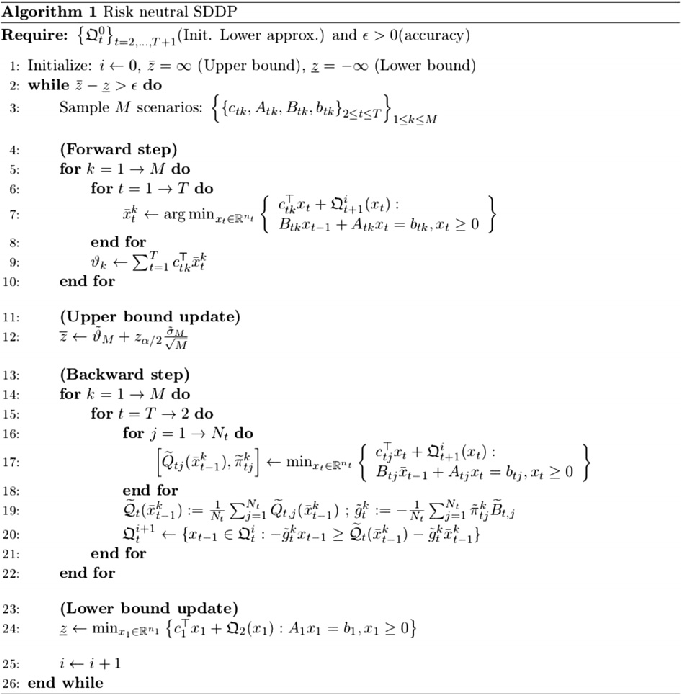

Fig. 1. Risk neutral SDDP.

and (1 a)-quantiles, which will be a natural way of dealing with the involved risk. Unfortunately such formulation will lead to a nonconvex and computationally intractable problem. This is one of the main reasons for using AV@Ra instead of V@Ra in the corresponding risk averse formulations. It is possible to show that in a certain sense AV@Ra( ) gives a best possible upper convex bound for V@Ra( ), [5].

It also could be mentioned that the (conditional) risk measures of the form (4.4) are not the only ones possible. We will discuss below some other examples of risk measures.

4.1. Risk averse SDDP method

With a relatively simple additional effort the SDDP algorithm can be applied to risk averse problems of the form (4.2). Let qt, t =2,...,T, be a sequence of chosen (law invariant coherent) risk measures and qtjn

be their conditional analogues (see, e.g., [11, Chapter 6] for a discussion of optimization problems involving coherent risk measures). Specifically, apart from risk measures of the form (4.3), we also consider mean-upper semideviation risk measures of order p:

½t 1

qtðZÞ¼E½Z þjt E ½Z E½Z p 1 p; ð4:5Þ where p 2 [1,1) and jt 2 [0,1]. In particular, for p = 1 this becomes

- 1
- 2jtEjZ E½Z j: ð4:6Þ

qtðZÞ¼E½Z þjtE½Z E½Z þ ¼ E½Z þ

Assuming that the stagewise independence condition holds, the corresponding dynamic programming equations are

Qtðxt 1;ntÞ¼ inf

cTtxt þQt 1ðxtÞ : Btxt 1 þ Atxt ¼ bt; xt P 0 ; ð4:7Þ

xt2Rnt

with Qtþ1ðxtÞ :¼ qtþ1½Qtþ1ðxt;nt 1Þ : ð4:8Þ At the first stage problem

Min x12Rn1

cT1x1 þQ2ðx1Þ s:t: A1x1 ¼ b1; x1 P 0; ð4:9Þ

should be solved. Note that because of the stagewise independence, the cost-to-go functions Qtþ1ðxtÞ and the risk measures qt+1 in (4.8) do not depend on the data process. Note also that since the considered risk measures are convex and monotone, the cost-to-go functions Qtþ1ðxtÞ are convex (cf., [11, Section 6.7.3]).

4.1.1. Backward step for mean-upper semideviation risk measures

The corresponding SAA problem is obtained by replacing the expectations with their sample average estimates. For risk measures of the form (4.5), the dynamic programming equations of the SAA problem take the form

cTtjxt þQtþ1ðxtÞ : Btjxt 1 þ Atjxt ¼ btj; xt P 0no

Qtjðxt 1Þ¼ inf

xt2Rnt

ð4 10Þ for j =1,...,Nt 1, with

!1=p;ð4:11Þ

XNt

Qtþ1ðxtÞ¼bQtþ1ðxtÞþjt 1N

½Qtþ1jðxtÞ  bQtþ1ðxtÞ p

t

j 1

t = T,...,2 and QT+1( ) 0, where

where i 2 {1,...,Nt} corresponds to the (1 at) sample quantile, i.e., numbers Qt+1,j(xt), j =1...,Nt, are arranged in the increasing order Qtþ1 pð1ÞðxtÞ 6 6 Qtþ1 pðNtÞðxtÞ and i ¼^jsuch that pð^jÞ is the smallest integer such that pð^jÞ P ð1 atÞNt. Note that if (1 at)Nt is not an integer, then i remains the same for small perturbations of xt.

1 Nt XNt

bQt 1ðxtÞ¼

Qtþ1;jðxtÞ:

j¼1

The optimal value of the SAA problem is given by the optimal value of the first stage problem

The corresponding subgradient of Qtþ1ðxtÞ is gtþ1 ¼ð1 ktÞbctþ1 þ kt ct 1i þ

ftþ1;j!;ð4:21Þ

atNt XNt

1

Min x 2Rn1

cT1x1 þQ2ðx1Þ s:t: A1x1 ¼ b1; x1 P 0: ð4:12Þ

j 1

In order to apply the backward step of the SDDP algorithm we need to know how to compute subgradients of the right hand side of (4.11). Let us consider first the case of p = 1. Then (4.11) becomes

where

(

0ifQt1;jðxtÞ Qtþ1;iðxtÞ < 0; ctþ1;j ctþ1i if Qt 1;jðxtÞ Qtþ1iðxtÞ P 0

ð4:22Þ

ftþ1j ¼

Qtþ1;jðxtÞ  bQt 1ðxtÞhi

Nt XNt

Qt 1ðxtÞ¼bQt 1ðxtÞþjt

: ð4:13Þ

The above approach is simpler than the one suggested in [12], and seems to be working as well.

þ

j 1

Let ct+1,j be a subgradient of Qt+1,j(xt), j =1, ,Nt, at the considered point xt. In principle it could happen that Qt+1,j( ) is not differentiable at xt, in which case it will have more than one subgradient at that point. Fortunately we need just one (any one) of its subgradients.

- 4.1.3. Forward step

The constructed lower approximations Qtð Þ of the cost-to-go functions define a feasible policy and hence can be used in the forward step procedure in the same way as it was discussed in Section 3.2. That is, for a given scenario (sample path), starting with a feasible first stage solution x1, decisions xt, t =2,...,T, are computed recursively going forward with xt being an optimal solution of

Minx

t

cTtxt Qt 1ðxtÞ s:t: Atxt ¼ bt Btxt 1; xt P 0; ð4:23Þ

for t =2,...,T. These optimal solutions can be used as trial decisions in the backward step of the algorithm.

Unfortunately there is no easy way to evaluate the risk-adjusted cost cT1x1 þ q2n

1

cT2x2ðn½2 Þþ   þqT n

T

cTTxTðn½T Þhið4:24Þ

of the obtained policy, and hence to construct an upper bound for the optimal value of the corresponding risk-averse problem (4.2). Therefore a stopping criterion based on stabilization of the lower bound was used in numerical experiments. Of course, the expected value (3.7) of the constructed policy can be estimated in the same way as in the risk neutral case by the averaging procedure.

- 5. Case study description

Then the corresponding subgradient of bQt 1ðxtÞ is ^ctþ1 ¼

1 Nt XNt

ct 1;j; ð4 14Þ and the subgradient of ½Qtþ1;jðxtÞ bQtþ1ðxtÞ þ is mt 1j ¼

j¼1

(

0ifQtþ1jðxtÞ Qtþ1ðxtÞ < 0; ctþ1j ^ctþ1 if Qtþ1jðxtÞ bQtþ1ðxtÞ > 0;

ð4:15Þ

and hence the subgradient of Qt 1ðxtÞ is gt 1 ¼ ^ctþ1 þ jt

Nt XNt

mtþ1j ð4 16Þ

j¼1

In the backward step of the SDDP algorithm the above formulas are applied to the piecewise linear lower approximations Qtþ1ð Þ exactly in the same way as in the risk neutral case (discussed in Section 3).

Let us consider now the case of p > 1. Note that then the cost-togo functions of the SAA problem are no longer piecewise linear. Nevertheless the lower approximations Qtþ1ð Þ are still constructed by using cutting planes and are convex piecewise linear. Similar to (4.16) the corresponding subgradient of Qtþ1ðxtÞ is (by the chain rule)

The Brazilian interconnected power system is a large scale system planned and constructed considering the integrated utilization of the generation and transmission resources of all agents and the use of inter-regional energy interchanges, in order to achieve cost reduction and reliability in power supply.

1 1 1 Nt XNt

gt 1 ¼ ^ctþ1 þ p 1jtqp

gtþ1;j ð4 17Þ

j¼1

The power generation facilities as of December 2010 are composed of more than 200 power plants with installed capacity greater than 30 megawatt, owned by 108 public and private companies, called ‘‘Agents’’–57 Agents own 141 hydro power plants located in 14 large basins, 69 with large reservoirs (monthly regulation or above), 68 run-of-river plants and four pumping stations. Considering only the National Interconnected System (SIN), without captive self-producers, the installed capacity reaches 171.1 gigawatt in 2020, with an increment of 61.6 gigawatt over the 2010 installed capacity of 109.6 gigawatt. Hydropower accounts for 56% of the expansion (34.8 gigawatt), while biomass and wind power account for 25% of the expansion (15.4 gigawatt).

t PN

j 1½Qtþ1;jðxtÞ  bQtþ1ðxtÞ p and

where q ¼ 1N

t

(

0ifQtþ1;jðxtÞ bQt1ðxtÞ<0 p½Qt jðxtÞ bQtþ1ðxtÞ p 1ðct 1j bctþ1Þ if Qt 1jðxtÞ bQtþ1ðxtÞ > 0:

gtþ1;j ¼

ð4:18Þ

4.1.2. Backward step for mean-AV@R risk measures

Let us consider risk measures of the form (4.3), i.e., qtðZÞ¼ð1 ktÞE½Z þktAV@Ra

t ½Z : ð4:19Þ The cost-to-go functions of the corresponding SAA problem are Qt 1ðxtÞ¼ð1 ktÞbQt 1ðxtÞ

The main transmission grid is operated and expanded in order to achieve safety of supply and system optimization. The inter-regional and inter-basin transmission links allow interchanges of large blocks of energy between areas making it possible to take advantage of the hydrological diversity between river basins. The main transmission grid system has 100.7 103 km of lines above

!;

atNt XNt

1

þ kt Qtþ1 iðxtÞþ

½Qtþ1;jðxtÞ Qtþ1;iðxtÞ þ

j 1

ð4:20Þ

230 kV, owned by 66 Agents, and is planned to reach 142.2 103 kilometer in 2020, an increment of 41.2%, mainly with the interconnection of the projects in the Amazonian region.

It is worth noting that the installed capacity of hydro plants corresponds to 79.1% of the December 2010 total installed capacity, but its relative position should diminish to 71.0% in 2020. Nevertheless, considering the domestic electricity supply, the hydro power supremacy will continue in 2020, standing for 73.4% of the total, as compared to 80.6% in December, 2010 (including imports). This relative reduction is offset by a strong penetration of biomass and wind generation. In this context, renewable sources maintain a high participation in electricity supply matrix (87.7%) (see [4]).

5.1. Operation planning problem

The purpose of hydrothermal system operation planning is to define an operation strategy which, for each stage of the planning period, given the system state at the beginning of the stage, produces generation targets for each plant. The usual objective is to minimize the expected value of the total cost along the planning period, so as to meet requirements on the continuity of energy supply subject to feasibility constraints. The operation costs comprise fuel costs, purchases from neighboring systems and penalties for failure in load supply. This is referred to as the risk neutral approach: the total cost is optimized on average, and for a particular realization of the random data process the costs could be much higher than their average values. Risk averse approaches, on the other hand, aim at finding a compromise between minimizing the average cost and trying to control the upper limit of the costs for some possible realizations of the data set at every stage of the process. The risk averse approach will be discussed later in this article.

The hydrothermal operating planning can be seen as a decision problem under uncertainty because of unknown variables such as future inflows, demand, fuel costs and equipment availability. The existence of large multi-year regulating reservoirs makes the operation planning a multistage optimization problem; in the Brazilian caseitisusualtoconsideraplanninghorizonof5 yearsonamonthly basis. The existence of multiple interconnected hydro plants and transmission constraints characterizes the problem as large scale. Moreover, because the value of energy generated in a hydro plant cannot be measured directly as a function of the plant state alone but rather in terms of expected fuel savings from avoided thermal generation, the objective function is also nonseparable [6].

In summary, the Brazilian hydro power operation planning problem is a multistage (60 stages), large scale (more than 200 power plants, of which 141 are hydro plants), nonlinear and nonseparable stochastic optimization problem. This setting far exceeds the computer capacity to solve it with adequate accuracy in reasonable time frame. The standard approach to solve this problem is to resort to a chain of models considering long, mid and short term planning horizon in order to be able to tackle the problem in a reasonable time. For the long-term problem, it is usual to consider an approximate representation of the system, the so-called aggregate system model, a composite representation of a multireservoir hydroelectric power system, proposed by Arvaniditis and Rosing [1], that aggregates all hydro power plants belonging to a homogeneous hydrological region into a single equivalent energy reservoir, and solves the resulting much smaller problem. The major components of the aggregate system model are: the equivalent energy reservoir model and the total energy inflow (controllable and uncontrollable), see Fig. 2. The energy storage capacity of the equivalent energy reservoir can be estimated as the energy that can be produced by the depletion of the reservoirs of a system, provided a simplified operating rule that approximates the actual depletion policy.

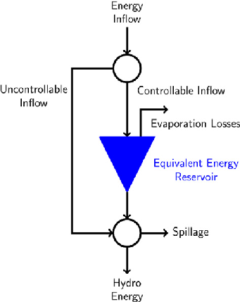

Fig. 2. Aggregate system model.

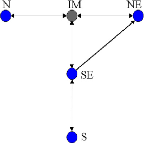

Fig. 3. Case-study interconnected power system.

For the Brazilian interconnected power system it is usual to consider four energy equivalent reservoirs, one in each one of the four interconnected main regions, SE, S, N and NE. For this simplified problem, one can use the SDDP approach and obtain the costto-go functions for each of the stages of the planning period. The resulting policy obtained with the aggregate representation can then be further be refined, so as to provide decisions for each of the hydro and thermal power plants. This can be done by solving the mid-term problem, considering a planning horizon up to a few months and individual representation of the hydro plants with boundary conditions (the expected cost-to-go functions) given by the solution of the long-term problem. This is the approach nowadays used for solving the long and mid term hydrothermal power planning in the Brazilian interconnected power system.

The numerical experiments were carried out considering instances of multistage linear stochastic problems based on an aggregate representation of the Brazilian Interconnected Power System long-term operation planning problem, as of January 2010, which can be represented by a graph with four generation nodes – comprising sub-systems Southeast (SE), South (S), Northeast (NE) and North (N) – and one (Imperatriz, IM) transshipment node (see Fig. 3).

The load of each area must be supplied by local hydro and thermal plants or by power flows among the interconnected areas. A

Empirically, we could observe that with 60 additional stages this effect is dissipated. Hence, the objective function of the planning problem is to minimize the expected cost of the operation along the 120 months planning horizon, while supplying the area loads and obeying technical constraints. In the case of the risk neutral approach, the objective function is the minimization of the expected value along the planning horizon of thermal generation costs plus a penalty term that reflects energy shortage. The case’s general data, such as hydro and thermal plant data and interconnection capacities were taken as static values through time. The demand for each system and the energy inflows in each reservoir were taken as time varying. The units for the energy inflows are in Mega Watts month (MWm) and the costs are in Brazilian real per MWm.

- Table 1 Deficit costs and depths.

% of total load curtailment Cost

- 1 0–5 1142.80
- 2 5–10 2465.40
- 3 10–20 5152.46
- 4 20–100 5845.54

- Table 2 Interconnection limits between systems.

To SE S NE N IM

From SE – 7379 1000 0 4000 S 5625 – 0 0 0 NE 600 0 – 0 2236 N000–– IM 3154 0 3951 3053 –

In order to set the hydrothermal operating planning problem within the framework of Section 2 one can proceed as follows. Considering the aggregate representation of the hydroplants, the energy conservation equation for each equivalent energy reservoir n can be written as

slack thermal generator of high cost that increases with the amount of load curtailment accounts for load shortage at each area (Table 1). Interconnection limits between areas may differ depending of the flow direction, see Table 2. The energy balance equation for each sub-system has to be satisfied for each stage and scenario. There are bounds on stored and generated energy for each sub-system aggregate reservoir and on thermal generations.

SEt;n ¼ SEt 1;n þ CEt n GHt;n SPt n: ð5:1Þ That is, the stored energy (SE) at the end of each stage (start of the next stage) is equal to the initial stored energy plus controllable energy inflow (CE) minus total hydro generated energy (GH) and losses (SP) due to spillage, evaporation, etc.

At each stage, the net subsystem load L, given by the remaining load after discounting the uncontrolled energy inflow from the total load, has to be met by the total hydro, the sum of all thermal generation belonging to system n, given by the set NTn, and the net interconnection energy flow (NF) to each subsystem. In other words, the energy balance equation for system n is

The long-term planning horizon for the Brazilian case comprises 60 months, due to the existence of multi-year regulation capacity of some large reservoirs. In order to obtain a reasonable cost-togo function that represents the continuity of the energy supply after these first 60 stages, a common practice is to add 60 more stages to the problem and consider a zero cost-to-go function at the end of the 120th stage. There is no definitive answer for how many stages should be added to remedy the end of horizon effect.

GHt n þ X j2NTn

GTt;j þ NFt n ¼ Lt;n ð5 2Þ

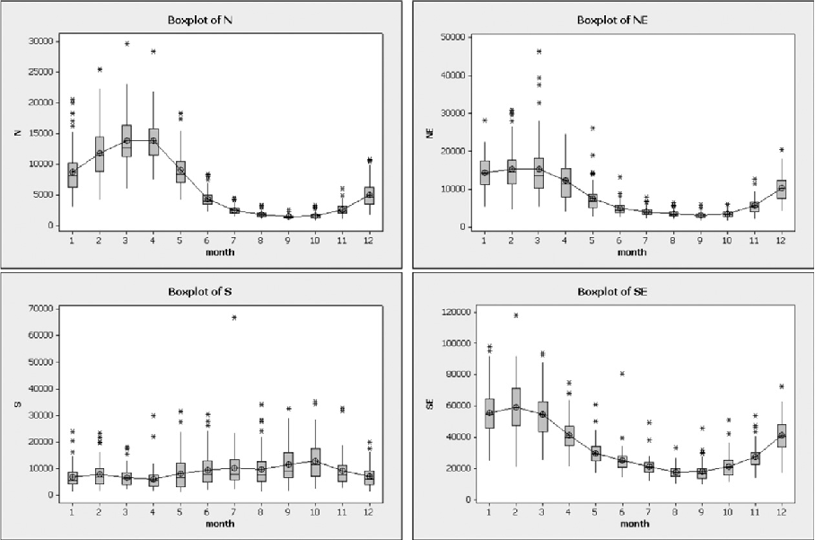

Fig. 4. Box plot of the inflows for each system.

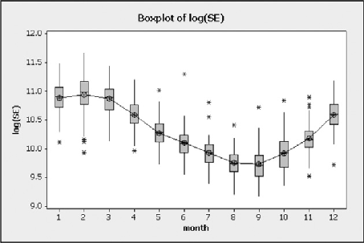

Fig. 5. Box plot of the log-observations of SE inflows.

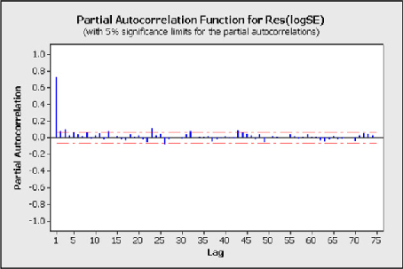

Fig. 6. Partial autocorrelation of the residuals of the log-observations of SE inflows.

where (GT) denotes the thermal generation. Note that this equation is always feasible (i.e., the problem has complete recourse) due to the inclusion of a dummy thermal plant with generation capacity equal to the demand and operation cost that reflects the social cost of not meeting the energy demand (deficit cost).

Constraints Btxt 1 + Atxt = bt are obtained writing

xt ¼ðSE;GH;GT;SP;NFÞ>t; bt ¼ðCE;LÞ>t; ct ¼ð0;0;CT;0;0Þ>t;

II0 I 0 0 I D 0 I

I 0000 00000

At ¼

; Bt ¼

;

where D ={dn,j = 1 for all j 2 NTn and zero else}, I and 0 are identity and null matrices, respectively, of appropriate dimensions and the components of CT are the unit operation cost of each thermal plant and penalty for failure in load supply. Note that hydroelectric generation costs are assumed to be zero. Physical constraints on variables like limits on the capacity of the equivalent reservoir, hydro and thermal generation, transmission capacity and so on are taken into account with constraints on xt. More details can be found in [16,6].

5.2. Time series model for the inflows

- 5.2.1. The historical data The historical data are composed of 79 observations of the nat-

ural monthly energy inflow (from year 1931 to 2009) for each of the four systems. Let Xt, t =1,...,948 denote a time series of monthly inflows for one of the regions. Histograms for the historical observations show positive skew for each of the 4 systems. This observation motivates considering Yt = log(Xt) for analysis. After taking the logarithm, the histograms become more symmetric.

Fig. 4 shows monthly box plots of regions inflows. It could be seen that inflows of the N, NE and SE systems have a clear seasonal behavior, while for the S system it is not obvious.

- 5.2.2. Time series analysis of SE

As an example we give below the analysis of the time series Xt of the SE data points. Analysis of the other 3 regions were carried out in a similar way. Fig. 5 shows box plots of monthly inflows of the log-observations Yt = log(Xt) of SE inflows. One can clearly note the seasonal behavior of the series, suggesting that a periodic monthly model could be a reasonable framework for this series.

Let ^lt ¼ ^ltþ12 be the monthly averages of Yt and Zt ¼ Yt ^lt be the corresponding residuals. Fig. 6 shows the partial autocorrelation of the Zt time series. High value at lag 1 and insignificant values for larger lags suggest the first order AR(1) autoregressive time series model for Zt:

Zt ¼ a þ /Zt 1 þ t: ð5:3Þ

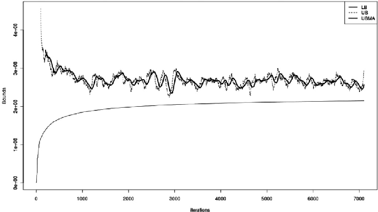

Fig. 7. Bounds for risk neutral SDDP with time series model.

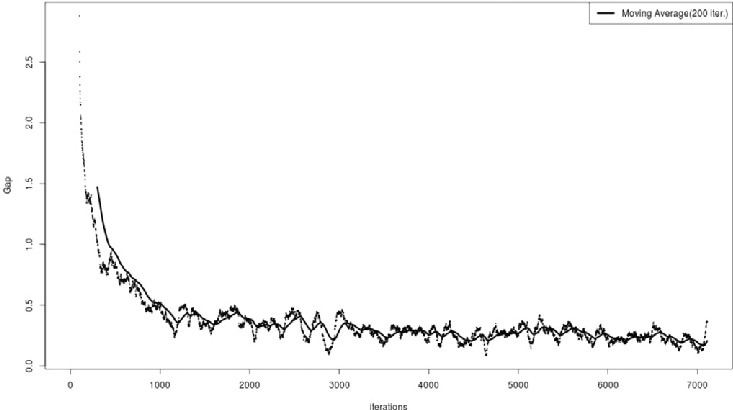

Fig. 8. Approximate gap for risk neutral SDDP.

Table 3 Total CPU time, bounds status and gap at iteration 2000 and 3000.

Iteration CPU time (h) LB ( 106) UB average ( 106) UB upper end ( 106) Gap (%)

2000 16.34 198.255 246.090 250.193 26.19 3000 38 204.835 246.164 250.136 22.11

For the adjusted model the estimate for the constant term a was highly insignificant and could be removed from the model. This is not surprising since values Zt by themselves are already residuals. Trying second order AR(2) model for Zt did not give a significant improvement of the fit.

Similar results were obtained for the other three subsystems. Therefore, we consider an AR(1) model for all subsystems in the subsequent analysis.

5.2.3. Model description

The analysis of Section 5.2.2 suggests the following model for the time series Yt for a given month

Yt ^lt ¼ /ðYt 1 ^lt 1Þþ t; ð5:4Þ where t is iid sequence having normal distribution N(0,r2). For the original times series Xt this gives

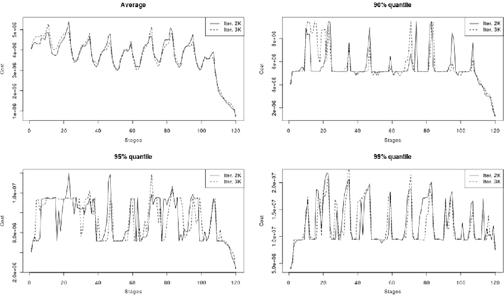

Fig. 9. Individual stage costs at iteration 2000 and 3000.

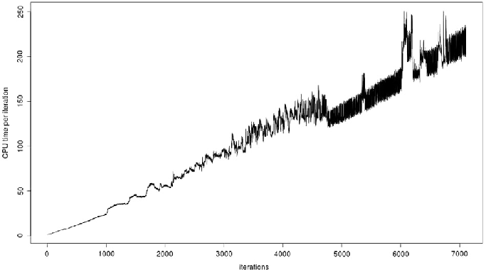

Fig. 10. CPU time per iteration.

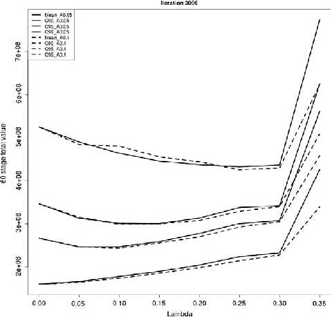

Fig. 11. Total policy value for 60 stages for a 2 {0.05,0.1} as function of k.

e^l

t /^lt 1X/t 1: ð5:5Þ

Xt ¼ e

t

Unfortunately this model is not linear in Xt and would result in a nonlinear multistage program. Therefore we proceed by using the following (first order) approximation of the function y = x/ at e^lt 1

Þ/ 1ðx e^lt 1

x/  ðe^lt 1

Þ/ þ /ðe^lt 1

Þ; which leads to the following approximation of the model (5.5) Xt ¼ e

e^l

þ /e^l

t ^lt 1ðXt 1 e^lt 1

Þ : ð5:6Þ

t

t

We allow, further, the constant / to depend on the month, and hence to consider the following time series model

e^l

þ cte^l

t ^lt 1ðXt 1 e^lt 1

Þ ð5:7Þ with ct = ct+12.

Xt ¼ e

t

t

We estimate the parameters of model (5.7) directly from the data.

^lt

Denote by Rt ¼ Xt e

e^lt . If the error term t is set to zero, i.e., the multiplicative error term e t is set to one, (5.7) can be written as:

Rt ¼ ctRt 1 ð5 8Þ

For each month, we perform a least square fit to the Rt sequence to obtain the monthly values for ct, assuming that ct = ct+12.

The errors t are modelled as a component of the multivariate normal distribution Nð0; bRtÞ, where bRt is the sample covariance matrix for

Xt e^lt

log

þ cte^lt ^lt 1ðXt 1 e^lt 1

Þ½  on a monthly basis, i.e., bRtþ12 ¼ bRt.

Validation of this model can be found in a working paper at: http://www.optimization-online.org/DB_HTML/2012/01/3307.html

6. Computational experiments

The numerical experiments are performed on an aggregated representation of the Brazilian Interconnected Power System operation planning problem with historical data as of January 2011. The study horizon is of 60 stages and the total number of considered stages is 120. We use the high demand profile setting described in [15]. We implement two versions of the risk averse SDDP algorithm, one with the mean-AV@R and one with the mean-upper semideviation risk measures both applied to solve the problem with the model suggested in Section 5 (with 8 state variables at each stage).

The SAA tree, generated in both cases, has 100 realizations in every stage with the total number of scenarios 1 100 100 = 100119. In the following experiments we run the SDDP algorithm with 1 trial solution per iteration. The individual stage costs and policy value are evaluated using 3000 randomly generated scenarios. Both implementations were written in C++ and using Gurobi 4.6. Detailed description of the algorithms can be found in [15]. The codes were run on 1 core of (2 quad-core Intel E5520 Xeons 2.26 gigahertz, and 24 gigabyte RAM) machine. Dual simplex was used as a default method for the LP solver.

In Section 6.1 the results for the SDDP algorithm with the time series model (5.7) are discussed within the risk neutral framework. The following Section 6.2 discusses the computational experiments for the risk averse approach with mean-AV@R and mean-upper

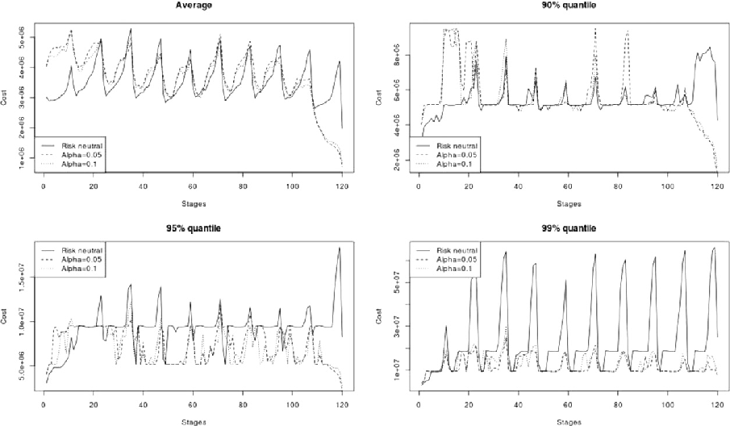

Fig. 12. Individual stage costs for k = 0.15 and a 2 {0.05,0.1}.

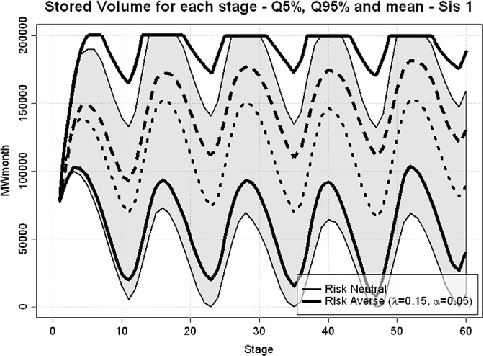

Fig. 13. SE system quantiles of stored volumes for each stage.

semideviation risk measures. Finally, we conclude this part by discussing variability of the SAA problems and sensitivity to the initial conditions in Sections 6.3 and 6.4.

- 6.1. Risk neutral approach results

In this section we investigate some computational issues related to the risk neutral SDDP applied to the problem with time series model (5.7). Fig. 7 shows the bounds for risk neutral SDDP for more than 7000 iterations. In the legend, we have the following notation:

LB: the lower bound (i.e., the first stage optimal value). UB: the upper end of the 95% confidence interval of the upper bound computed approximately using as observations the past 100 forward step realizations. UBMA: moving average of UB using the past 100 values.

- Fig. 7 illustrates typical behavior of the SDDP bounds – fast in-

crease in the lower bound for the first iterations and then a slow increase in later iterations. The upper bound exhibits some variability along with a decreasing trend. We should notice the relatively slow convergence.

- Fig. 8 shows the evolution of the approximate gap over itera-

tions. The continuous line provides a smoothing of the observations to get the approximate trend.

We consider an approximate gap defined by UBMA LBLB. This is just an approximation of the real gap defined as the difference between the upper end of 95% confidence interval and the lower bound. Due to the significant computational effort to evaluate adequately this gap, we approximate the observations by taking the past 100 forward step realizations. We perform at iteration 2000 and iteration 3000 a proper forward step with 3000 scenarios (see Table 3 for the details). We can see in Fig. 8 the fast decrease in the first 1000 iterations and then a relatively slow decay for later ones.

Table 3 shows the lower bound, upper bound 95% confidence interval (mean and upper end), the CPU time along with the gap (i.e., UBupper LBLB) at iteration 2000 and 3000. The confidence interval for the upper bound was computed using 3000 randomly generated scenarios.

The approximate gap (of 35.84% and 29.24% at iterations 2000 and 3000, respectively) gives a slightly higher value than the accurate gap. Also, to reach a gap of 22.11%, which is quite large, 3000 iterations were needed. The experiment took 136,740.7 seconds (i.e., approximately 38 hours). Fig. 9 shows the individual stage costs at iteration 2000 and iteration 3000 for the risk neutral SDDP.

Some differences are perceivable between the individual stage cost distributions at iteration 2000 and iteration 3000. These differences are noticeable in the 95% quantile. However, these differences don’t have a dramatic effect on the general shape of the distribution. This observation is expected since running the algorithm further will provide a more accurate representation of the optimal solution. For this research purposes, it seems reasonable

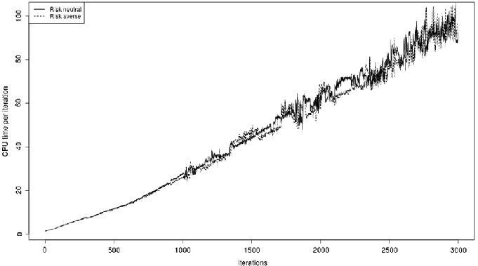

Fig. 14. CPU time per iteration for the risk neutral and risk averse approaches.

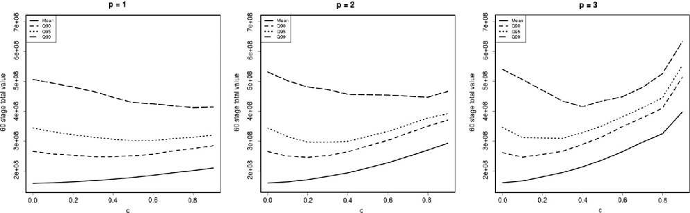

Fig. 15. 60 stages total costs for p 2 {1,2,3}.

to stop the algorithm at a computationally acceptable running time without any significant impact on the general conclusions.

Fig. 10 shows the CPU time per iteration for the risk neutral SDDP for more than 7000 iterations. We can see the linear trend of the CPU time per iteration. The discrepancy occurring at some iterations is most likely due to the shared resources feature of the computing environment.

6.2. Risk averse approach results

6.2.1. Mean-AV@R risk measures

In this section, we investigate some computational issues related to the mean-AV@R risk averse SDDP applied to the operation planning problem with the time series model suggested in Section 5.2. Fig. 11 shows the total policy value for the first 60 stages at iteration 3000 for a 2 {0.05,0.1} and k 2 {0,0.05,0.1, ,0.35}. The dotted line corresponds to a = 0.1 and the continuous line corresponds to a = 0.05. The figure plots the average cost and the 90%, 95% and 99% quantiles for each a.

Practically there is no significant difference between the 60 stages total cost for a = 0.05 and for a = 0.1 when 0 6 k 6 0.3. For k = 0.35, the total 60 stages policy value is lower for a = 0.1. Furthermore, we can see that as k increases (i.e. more importance is given to the high quantile minimization) the average policy value increases and an improvement in some quantiles is observed for

0<k 6 0.30. The ‘‘price of risk aversion’’ is what we lose on average compared to the risk neutral case (i.e. k = 0). It is the price ‘‘paid’’ for some protection against extreme values.

Fig. 12 shows the individual stage costs at iteration 3000 for k = 0.15. In this figure, we compare the individual stage costs for the risk neutral case, a = 0.05 and a = 0.1. When we compare the risk averse approach and the risk neutral approach, we can see the significant reduction in the 99% quantile and the loss in the average policy value that occurs mostly in the first stages. Most of the reduction of the 90% and 95% quantiles happens in the last 15 stages. Furthermore, there is no significant difference between the individual stage costs for a = 0.05 and a = 0.1.

As an example of the impact of the risk averse approach in the decision variables, Fig. 13 shows the evolution of SE system stored volumes along the planning period, for risk neutral and risk averse for k = 0.15 and a = 0.05, where one can observe higher values of the stored volumes with the risk averse approach, as is expected. The availability of higher stored volumes makes it possible, in case of droughts, to be able to avoid large deficits and costs spikes as shown in Fig. 12. Notice also that with the risk averse method, there is an increased likelihood of spillage.

Among the interesting questions that we can ask is: how much does the risk averse approach cost in terms of CPU time compared to the risk neutral approach? Fig. 14 shows the CPU time per iteration for the risk neutral and the AV@R risk averse approach with

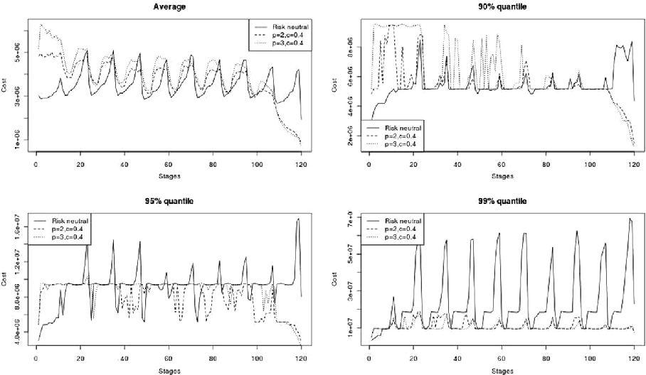

- Fig. 16. Individual stage costs at iteration 3000 for c = 0.4 and p 2 {2,3}.

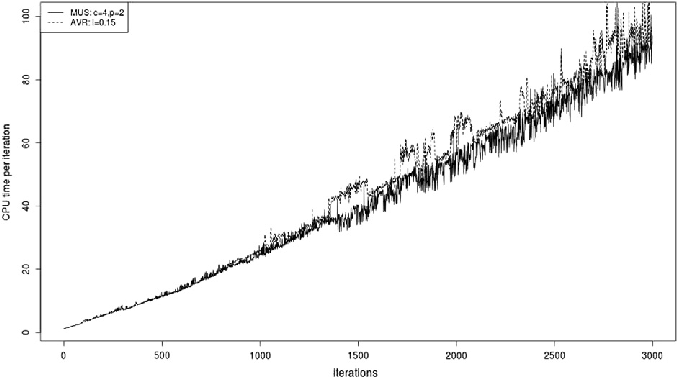

- Fig. 17. CPU time per iteration: AV@R vs. mean-upper semideviation.

k = 0.15 for the first 3000 iterations. Practically there is no loss in CPU time per iteration when compared to the risk neutral approach.

- 6.2.2. Mean-upper semideviation risk measures In this section, we investigate some computational issues re-

lated to the mean-upper semideviation risk averse SDDP discussed in Section 4.1.

Fig. 15 shows the mean, 90%, 95% and 99% quantiles of the total cost for the first 60 stages for different values of p 2 {1,2,3}. Notice that a similar general behavior occurs as in the mean-AV@R risk averse approach: an increase of the average value against a decrease of the high quantiles on a specific range of values. For p = 1 and constant jt = c, we observe a continuous decrease of

the 99% quantile for all values of j 2 {0.0,...,0.9}. Also, notice the slow increase of the average policy value. For p = 2, less reduction of the 99% quantile happens compared to the case of p =1. However, the best reduction in 95% and 90% quantiles moves toward lower penalty value along with an increase of the quantiles values for the higher penalization. For p = 3, we can observe a significant increase of the total policy quantiles for the high values of c and a similar trend of achieving the best quantiles reduction from the low penalty values.

Fig. 16 shows the individual stage costs plots at iteration 3000 for the risk neutral case and the risk averse case for {p =2,c = 0.4} and {p =3,c = 0.4}. Similar observations hold as the mean-AV@R risk averse approach: a loss on average occurring in the first stages and a significant impact on the 99% quantile.

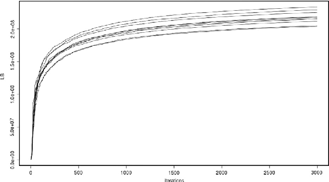

Fig. 18. Lower bound variability for risk neutral SDDP.

Table 4 Total CPU time and gap at iteration 2000.

95% CI left ( 106) Average ( 106) 95% CI right ( 106) Range/(Avg. LB) (%) Variability (%)

Lower bound 211.456 217.439 223.422 13.61 4.43 Average policy 253.239 260.672 268.105 17.04 5.51 Upper bound 256.466 264.006 271.547 17.27 5.59

Fig. 17 shows the CPU time per iteration for the mean-AV@R (k = 0.15) and mean-upper semideviation (c = 0.4,p = 2) risk measures. There is no significant difference between both of the approaches.

6.3. Variability of SAA problems

In this section we discuss variability of the bounds of optimal values of the SAA problems. Recall that an SAA problem is based on a randomly generated sample, and as such is subject to random perturbations, and in itself is an approximation of the ‘‘true’’ problem. As discussed in [14], for a simple model of the inflows (referred to as the independent model) there was little variability in

the lower bound – it was in the order of 0.8% of the average lower bound over a sample of 20 scenario trees.

In this experiment we generate ten SAA problems, using time series model (5.7), each one having 1 100 100 = 100119 scenarios. Then we run 3000 iterations of the SDDP algorithm for the risk neutral approach. At the last iteration, we perform a forward step to evaluate the obtained policy with 5000 scenarios and compute the average policy value. Fig. 18 shows the lower bound evolution for each of the considered SAA problems for 3000 iterations. We can see an increasing range of the lower bound value in early iterations, followed by a stabilization of the range in later iterations.

Table 4 shows the 95% confidence interval for the lower bound, average policy value and upper bound at iteration 3000 over a

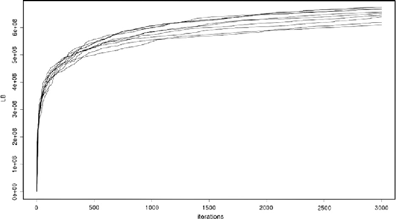

Fig. 19. Lower bound variability for risk averse SDDP (k = 0.15).

- Table 5 Total CPU time and gap at iteration 3000.

95% CI left ( 106)

Average ( 106)

95% CI right

Range/(Avg. LB) ( 106) (%)

Variability (%)

Lower bound 637.924 652.146 666.368 10.03 3.51 Average policy 284.392 292.042 299.691 5.82 1.89

- Table 6 Initial conditions.

SE S NE N

Inflows 53,442.7 6,029.9 18,154.9 5,514.4 Reservoir level 59,419.3 5,874.9 12,859.2 5,271.5

Total 112,862.0 11,904.8 31,014.1 10,785.9 % of Maximum capacity 56.23 60.68 59.86 84.63

- Table 7 Maximum stored volume.

SE S NE N Maximum storage 200,717.6 19,617.2 51,806.1 12,744.9

sample of 10 SAA problems. Each of the observations was computed using 5000 scenarios. The last 2 columns of the table shows the range divided by the average of the lower bound where the range is the difference between the maximum and minimum observation and the variability. The variability is defined as the standard deviation divided by the average value of the lower bound.

Fig. 19 shows the lower bound evolution for the mean-AV@R risk averse SDDP with k = 0.15 and a = 0.05 for 3000 iterations. Similar to the risk neutral case, we can see an increasing range of

the lower bound value with the increase of the number of iterations in the beginning, followed by a stabilization of the range in later iterations. Furthermore, some fluctuations in the bounds occur.

Table 5 shows the 95% confidence interval for the lower bound and average policy value at iteration 3000 over a sample of ten SAA problems. Each of the observations was computed using 3000 scenarios. The last column of the table shows the range divided by the average of the lower bound.

The risk averse approach shows lower variability of the lower bound and the average policy value.

6.4. Sensitivity to the initial conditions

The purpose of this experiment is to investigate the impact of changing initial conditions of the simulated time series (with the multiplicative error terms) on the distribution of the individual stage costs. In the above experiments, we considered the initial volumes and the reservoir levels based on January 2011 data. Table 6 shows the numerical values for these parameters.

Table 7 shows the maximum storage value for each system.

We consider the following 2 initial levels: 25% and 75% of the maximum storage capacity in each system. Fig. 20 shows the individual stage costs for the risk neutral approach in two cases: all the reservoirs start at 25% or at 75% of the maximum capacity. The dashed curve denotes the 75% initial reservoir level and the continuous denotes the 25% initial level.

When we start with 25% of the maximum capacity in all reservoirs, high costs occur for the first stages which reflects the recourse to the expensive thermal generation to satisfy the demand. Similarly, when we start with 75% of the maximum capacity in all reservoirs low costs occur in the first stages. Interestingly in both cases the costs become identical starting from 60th stage.

Similarly, Fig. 21 shows the individual stage costs for the meanAV@R risk averse approach with k = 0.15 in two cases: all the reservoirs start at 25% or at 75% of the maximum capacity.

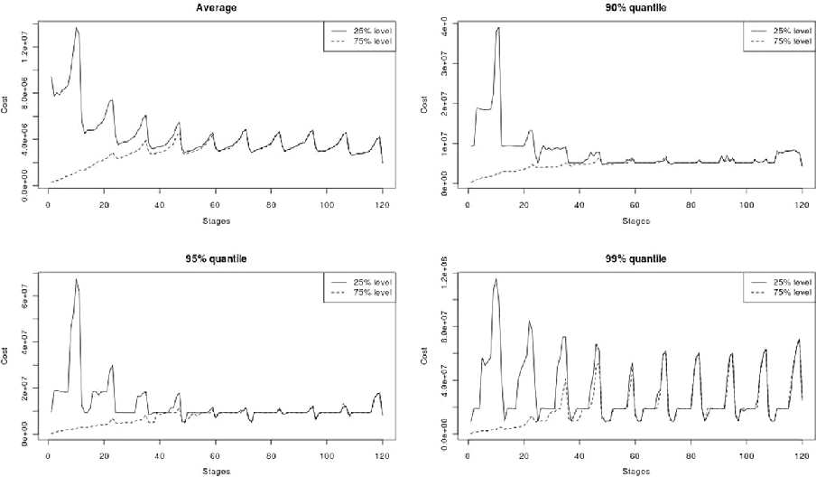

Fig. 20. Sensitivity to initial conditions (risk neutral).

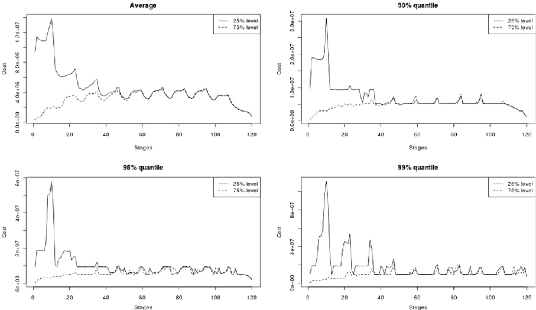

Fig. 21. Sensitivity to initial conditions (risk averse: k = 0.15).

Similar observations as the risk neutral case hold for the risk averse approach: high costs occur for the first stages when we start with 25% levels and low costs occur in the first stages when we start with 75% levels. The two costs have similar distributions at later stages. However, one key difference from the risk neutral case is the values attained in the peaks are lower (see Fig. 20).

7. Conclusions

The problem formulation and modeling related issues were discussed in Sections 1 and 2. A generic description of the SDDP algorithm is presented in Section 3. The adaptive risk averse approach was discussed in Section 4 under two different perspectives: one through the mean-AV@R and the other using the mean-upper semideviation risk measures.

A case study along a time series model for the inflows was presented and discussed in Section 5. The computational results for the hydrothermal system operation planning problem of the Brazilian interconnected power system was presented in Section 6. We discussed in Section 6.1 some computational aspects of the risk neutral SDDP applied to solve the problem with the time series model suggested in Section 5.2. We observed a slow convergence of the algorithm along a linear trend of the CPU time per iteration. Section 6.2 summarizes the results for the mean-AV@R and meanupper semideviation risk measures. We have seen that the risk averse approach ensures a reduction in the high quantile values of the individual stage costs. This protection comes with an increase of the average policy value – the price of risk aversion. Furthermore, both of the risk averse approaches come with practically no extra computational effort. In Section 6.3 we have seen that there was no significant variability of the SAA problems. Finally, we investigated in Section 6 the impact of the initial conditions on the individual stage costs.

References

- [1] N.V. Arvaniditis, J. Rosing, Composite representation of a multireservoir hydroelectric power system, IEEE Transactions on Power Apparatus and Systems 89 (2) (1970) 319–326.
- [2] A. Eichhorn, W. Römisch, Polyhedral risk measures in stochastic programming, SIAM Journal on Optimization 16 (2005) 69–95.
- [3] V. Guigues, W. Römisch, Sampling-based decomposition methods for multistage stochastic programs based on extended polyhedral risk measures, SIAM Journal on Optimization 22 (2012) 86–312.
- [4] Ministry of Mines and Energy MME, Electricity in the Brazilian Energy Plan – PDE 2020, July 2011, Secretariat of Energy Planning and Development.
- [5] A. Nemirovski, A. Shapiro, Convex approximations of chance constrained programs, SIAM Journal on Optimization 17 (2006) 969–996.
- [6] M.V.F. Pereira, L.M.V.G. Pinto, Stochastic optimization of a multireservoir hydroelectric system—a decomposition approach, Water Resources Research 21 (6) (1985) 779–792.
- [7] M.V.F. Pereira, L.M.V.G. Pinto, Multi-stage stochastic optimization applied to energy planning, Mathematical Programming 52 (1991) 359–375.
- [8] A.B. Philpott, Z. Guan, On the convergence of stochastic dual dynamic programming and related methods, Operations Research Letters 36 (2008) 450–455.
- [9] A.B. Philpott, V.L. de Matos, Dynamic sampling algorithms for multi-stage stochastic programs with risk aversion, European Journal of Operational Research 218 (2012) 470–483.
- [10] A. Ruszczyn´ski, A. Shapiro, Conditional risk mappings, Mathematics of Operations Research 31 (2006) 544–561.
- [11] A. Shapiro, D. Dentcheva, A. Ruszczyn´ski, Lectures on Stochastic Programming: Modeling and Theory, SIAM, Philadelphia, 2009.
- [12] A. Shapiro, Analysis of stochastic dual dynamic programming method, European Journal of Operational Research 209 (2011) 63–72.
- [13] A. Shapiro, Topics in Stochastic Programming, CORE Lecture Series, Universite Catholique de Louvain, 2011.
- [14] A. Shapiro, W. Tekaya, J.P. Da Costa and M.P. Soares, Report for technical cooperation between Georgia Institute of Technology and ONS – Operador Nacional do Sistema Eletrico – Phase 1, Technical Report, 2011.
- [15] A. Shapiro and W. Tekaya, Report for technical cooperation between Georgia Institute of Technology and ONS – Operador Nacional do Sistema Eletrico – Risk Averse Approach, Technical Report, 2011.
- [16] L.A. Terry, M.V.F. Pereira, T.A. Araripe Neto, L.E.C.A. Pinto, P.R.H. Sales, Coordinating the energy generation of the Brazilian national hydrothermal electrical generating system, Interfaces 16 (1) (1986) 16–38.

